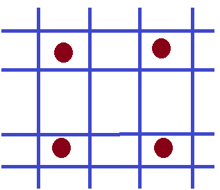
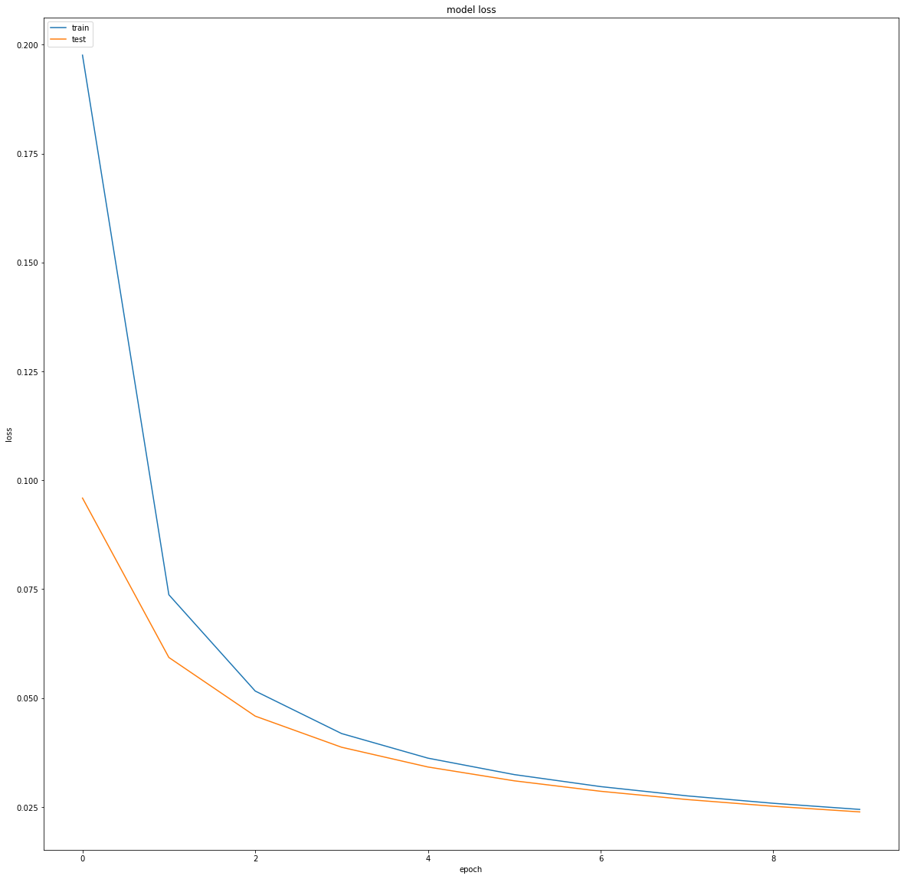
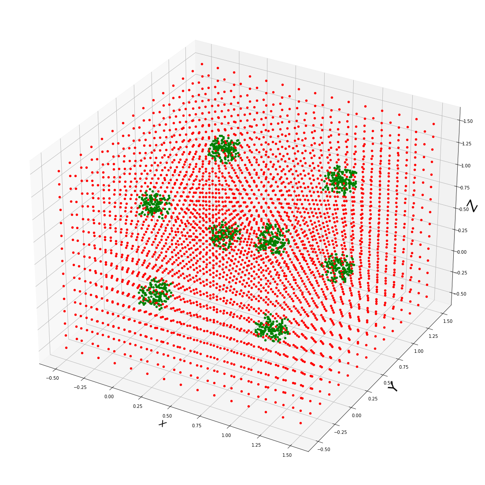
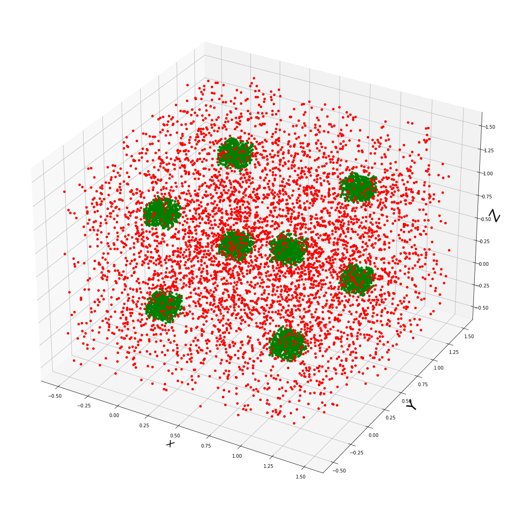

```python
import numpy as np
import math
import random
from sklearn.utils import shuffle
from sklearn.preprocessing import normalize
from sklearn.preprocessing import MinMaxScaler
from sklearn.linear_model import Perceptron
from sklearn.metrics import accuracy_score
import tensorflow as tp
from tensorflow.keras.models import Sequential
from tensorflow.keras.layers import Dense
import joblib
from joblib import Parallel, delayed  
import multiprocessing
import time
import matplotlib.pyplot as plt
from mlxtend.plotting import plot_decision_regions
from mpl_toolkits.mplot3d import Axes3D
scaler_filename = "scaler.save"
```

# Estrategia

## camada de 12 perceptrons para limitar os pontos em cada eixo em seu valor máximo e minimo.

### exemplo em uma visualização 2D



# Geração de dados


```python
dataSize = 100
x = np.linspace(-0.5,1.5, dataSize)
y = np.linspace(-0.5,1.5, dataSize)
z = np.linspace(-0.5,1.5, dataSize)
np.random.shuffle(x)
np.random.shuffle(y)
np.random.shuffle(z)
data = []
wrongData = []
dataLabel = []
wrongLabel = []
for i in range(len(x)):
    for j in range(len(y)):
        for k in range(len(z)):
            data.append([x[i], y[j], z[k]])
            #000
            if (x[i]>=-0.1 and x[i]<0.1) and (y[j]>=-0.1 and y[j]<0.1) and (z[k]>=-0.1 and z[k]<0.1):
                dataLabel.append([1,1,0,1,1,1,0,1,1,1,0,1])
            #100
            elif (x[i]>=0.9 and x[i]<1.1) and (y[j]>=-0.1 and y[j]<0.1) and (z[k]>=-0.1 and z[k]<0.1):
                dataLabel.append([1,0,1,1,1,1,0,1,1,1,0,1])
            #010
            elif (x[i]>=-0.1 and x[i]<0.1) and (y[j]>=0.9 and y[j]<1.1) and (z[k]>=-0.1 and z[k]<0.1):
                dataLabel.append([1,1,0,1,1,0,1,1,1,1,0,1])
            #110
            elif (x[i]>=0.9 and x[i]<1.1) and (y[j]>=0.9 and y[j]<1.1) and (z[k]>=-0.1 and z[k]<0.1):
                dataLabel.append([1,0,1,1,1,0,1,1,1,1,0,1])
            #001
            elif (x[i]>=-0.1 and x[i]<0.1) and (y[j]>=-0.1 and y[j]<0.1) and (z[k]>=0.9 and z[k]<1.1):
                dataLabel.append([1,1,0,1,1,1,0,1,1,0,1,1])
           #101
            elif (x[i]>=0.9 and x[i]<1.1) and (y[j]>=-0.1 and y[j]<0.1) and (z[k]>=0.9 and z[k]<1.1):
                dataLabel.append([1,0,1,1,1,1,0,1,1,0,1,1])
            #011
            elif (x[i]>=-0.1 and x[i]<0.1) and (y[j]>=0.9 and y[j]<1.1) and (z[k]>=0.9 and z[k]<1.1):
                dataLabel.append([1,1,0,1,1,0,1,1,1,0,1,1])
            #111
            elif (x[i]>=0.9 and x[i]<1.1) and (y[j]>=0.9 and y[j]<1.1) and (z[k]>=0.9 and z[k]<1.1):
                dataLabel.append([1,0,1,1,1,0,1,1,1,0,1,1])
            else:
                data.pop()
                wrongData.append([x[i], y[j], z[k]])
                label = [1,1,1,1,1,1,1,1,1,1,1,1]
                if(x[i]<-0.1):
                    label[0] = 0
                if(x[i]<0.9):
                    label[2] = 0
                if(x[i]>0.1):
                    label[1] = 0
                if(x[i]>=1.1):
                    label[3] = 0
                if(y[j]<-0.1):
                    label[4] = 0
                if(y[j]<0.9):
                    label[6] = 0
                if(y[j]>0.1):
                    label[5] = 0
                if(y[j]>=1.1):
                    label[7] = 0
                if(z[k]<-0.1):
                    label[8] = 0
                if(z[k]<0.9):
                    label[10] = 0
                if(z[k]>0.1):
                    label[9] = 0
                if(z[k]>=1.1):
                    label[11] = 0
                wrongLabel.append(label)
dataReplicated =np.repeat(np.array(data), math.floor(len(wrongData)/len(data)), axis=0)
dataLabel =np.repeat(np.array(dataLabel), math.floor(len(dataReplicated)/len(dataLabel)), axis=0)
data = np.concatenate((dataReplicated, np.array(wrongData)), axis=0)
dataLabel =  np.concatenate((dataLabel,  wrongLabel), axis=0)
data, dataLabel = shuffle(data, dataLabel)

```


```python

model = model = Sequential()
model.add(Dense(12, input_shape=(3,), kernel_initializer='zeros', activation='sigmoid'))
model.compile(loss='binary_crossentropy', optimizer='adam', metrics=['binary_accuracy'])
history =model.fit(np.array(data), np.array(dataLabel), epochs=10, batch_size=100, verbose=1, validation_split=0.2)
```

    Epoch 1/10
    15872/15872 [==============================] - 12s 745us/step - loss: 0.1976 - binary_accuracy: 0.9369 - val_loss: 0.0959 - val_binary_accuracy: 0.9673
    Epoch 2/10
    15872/15872 [==============================] - 12s 731us/step - loss: 0.0737 - binary_accuracy: 0.9754 - val_loss: 0.0593 - val_binary_accuracy: 0.9808
    Epoch 3/10
    15872/15872 [==============================] - 12s 737us/step - loss: 0.0516 - binary_accuracy: 0.9831 - val_loss: 0.0459 - val_binary_accuracy: 0.9840
    Epoch 4/10
    15872/15872 [==============================] - 12s 731us/step - loss: 0.0419 - binary_accuracy: 0.9861 - val_loss: 0.0387 - val_binary_accuracy: 0.9881
    Epoch 5/10
    15872/15872 [==============================] - 11s 723us/step - loss: 0.0362 - binary_accuracy: 0.9888 - val_loss: 0.0342 - val_binary_accuracy: 0.9894
    Epoch 6/10
    15872/15872 [==============================] - 12s 731us/step - loss: 0.0324 - binary_accuracy: 0.9896 - val_loss: 0.0310 - val_binary_accuracy: 0.9899
    Epoch 7/10
    15872/15872 [==============================] - 12s 737us/step - loss: 0.0297 - binary_accuracy: 0.9900 - val_loss: 0.0286 - val_binary_accuracy: 0.9902
    Epoch 8/10
    15872/15872 [==============================] - 12s 728us/step - loss: 0.0276 - binary_accuracy: 0.9904 - val_loss: 0.0267 - val_binary_accuracy: 0.9908
    Epoch 9/10
    15872/15872 [==============================] - 12s 737us/step - loss: 0.0258 - binary_accuracy: 0.9910 - val_loss: 0.0252 - val_binary_accuracy: 0.9914
    Epoch 10/10
    15872/15872 [==============================] - 12s 738us/step - loss: 0.0244 - binary_accuracy: 0.9915 - val_loss: 0.0239 - val_binary_accuracy: 0.9918
    


```python
plt.plot(history.history['loss'])
plt.plot(history.history['val_loss'])
plt.title('model loss')
plt.ylabel('loss')
plt.xlabel('epoch')
plt.legend(['train', 'test'], loc='upper left')
plt.show()
```


    

    


```python
testSize= 15
xTest = np.linspace(-0.5,1.5, testSize)
yTest = np.linspace(-0.5,1.5, testSize)
zTest = np.linspace(-0.5,1.5, testSize)
testingData = []
prediction = []
for i in range(len(xTest)):
    for j in range(len(yTest)):
        for k in range(len(zTest)):
            testingData.append([xTest[i], yTest[j], zTest[k]])
# Adicionando mais pontos no vértice para melhorar visualização no gráfico
for i in range(-5,5):
    for j in range(-5,5):
        for k in range(-5,5):
            testingData.append([random.choice([0,1])+(0.02*i), random.choice([0,1])+(0.02*j), random.choice([0,1])+(0.02*k)])
prediction = model.predict(np.array(testingData))
```

# Dados de Validação


```python
fig = plt.figure()
ax = fig.add_subplot(111, projection='3d')
ax.set_xlabel('$X$', fontsize=20, rotation=150)
ax.set_ylabel('$Y$', fontsize=30, rotation=60)
ax.set_zlabel('$Z$', fontsize=30, rotation=60)
ax.yaxis._axinfo['label']['space_factor'] = 3.0
plt.rcParams['figure.figsize'] = [20, 20]
for i in range(len(testingData)):
    if(np.count_nonzero(prediction[i] >=0.5)>8):
        ax.scatter(testingData[i][0], testingData[i][1], testingData[i][2], c='g', marker='o')
    else:
        ax.scatter(testingData[i][0], testingData[i][1], testingData[i][2], c='r', marker='o')
plt.show()
```


    

    


# Dados de treinamento


```python
fig = plt.figure()
ax = fig.add_subplot(111, projection='3d')
ax.set_xlabel('$X$', fontsize=20, rotation=150)
ax.set_ylabel('$Y$', fontsize=30, rotation=60)
ax.set_zlabel('$Z$', fontsize=30, rotation=60)
ax.yaxis._axinfo['label']['space_factor'] = 3.0
plt.rcParams['figure.figsize'] = [20, 20]
for i in range(10000):
    if(np.count_nonzero(np.array(dataLabel[i]) >=0.5)>8):
        ax.scatter(data[i][0], data[i][1], data[i][2], c='g', marker='o')
    else:
        ax.scatter(data[i][0], data[i][1], data[i][2], c='r', marker='o')
plt.show()
```


    

    


```python

```
