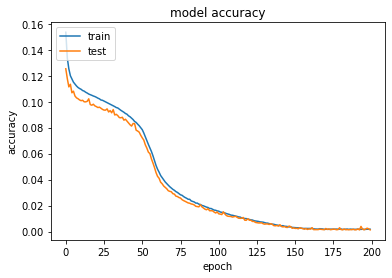
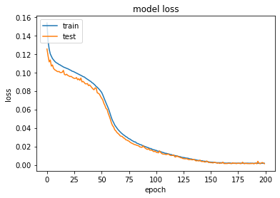
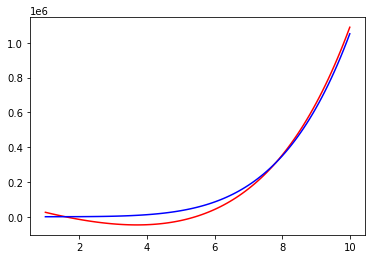

```python
import numpy as np
from sklearn.preprocessing import MinMaxScaler
import math
import random
import matplotlib.pyplot as plt
import tensorflow
from tensorflow.keras.optimizers import SGD
from tensorflow.keras.models import Sequential
from tensorflow.keras.layers import Dense
from tensorflow.keras.utils import to_categorical
```


```python
inputs=[]
outputs=[]
scaler = MinMaxScaler()
def sourceFunction(x):
    return (10*math.pow(x,5))+(5*math.pow(x,4))+(2*math.pow(x,3))-(0.5*math.pow(x,2))+(3*x)+2

dataSize = 5000
scaler = MinMaxScaler()
inputs = np.linspace(0,20,dataSize)
np.random.shuffle(inputs)
for i in range(len(inputs)):
        outputs.append(sourceFunction(inputs[i]))
outputs = scaler.fit_transform(np.array(outputs).reshape(-1, 1)).flatten()
trainingSet = np.array(inputs[:math.floor(len(inputs)*0.8)])
trainingLabels = np.array(outputs[:math.floor(len(outputs)*0.8)])
testingSet = np.array(inputs[math.floor(len(inputs)*0.8):])
testingLabels = np.array(outputs[math.floor(len(outputs)*0.8):])
```


```python
model = Sequential()
model.add(Dense(2, input_shape=(1,), kernel_initializer='normal', activation='sigmoid'))
model.add(Dense(1, activation='linear', kernel_initializer='normal'))
model.summary()
```

    Model: "sequential"
    _________________________________________________________________
     Layer (type)                Output Shape              Param #   
    =================================================================
     dense (Dense)               (None, 2)                 4         
                                                                     
     dense_1 (Dense)             (None, 1)                 3         
                                                                     
    =================================================================
    Total params: 7
    Trainable params: 7
    Non-trainable params: 0
    _________________________________________________________________
    


```python
model.compile(loss='mean_absolute_error', optimizer='adam', metrics=['mean_absolute_error']) 
history = model.fit(trainingSet, trainingLabels, epochs=200, batch_size=10, verbose=1,validation_split = 0.2)
```

    Epoch 1/200
    320/320 [==============================] - 1s 1ms/step - loss: 0.1535 - mean_absolute_error: 0.1535 - val_loss: 0.1253 - val_mean_absolute_error: 0.1253
    Epoch 2/200
    320/320 [==============================] - 0s 762us/step - loss: 0.1335 - mean_absolute_error: 0.1335 - val_loss: 0.1177 - val_mean_absolute_error: 0.1177
    Epoch 3/200
    320/320 [==============================] - 0s 793us/step - loss: 0.1252 - mean_absolute_error: 0.1252 - val_loss: 0.1114 - val_mean_absolute_error: 0.1114
    Epoch 4/200
    320/320 [==============================] - 0s 790us/step - loss: 0.1200 - mean_absolute_error: 0.1200 - val_loss: 0.1134 - val_mean_absolute_error: 0.1134
    Epoch 5/200
    320/320 [==============================] - 0s 778us/step - loss: 0.1176 - mean_absolute_error: 0.1176 - val_loss: 0.1069 - val_mean_absolute_error: 0.1069
    Epoch 6/200
    320/320 [==============================] - 0s 756us/step - loss: 0.1151 - mean_absolute_error: 0.1151 - val_loss: 0.1081 - val_mean_absolute_error: 0.1081
    Epoch 7/200
    320/320 [==============================] - 0s 778us/step - loss: 0.1136 - mean_absolute_error: 0.1136 - val_loss: 0.1044 - val_mean_absolute_error: 0.1044
    Epoch 8/200
    320/320 [==============================] - 0s 781us/step - loss: 0.1121 - mean_absolute_error: 0.1121 - val_loss: 0.1029 - val_mean_absolute_error: 0.1029
    Epoch 9/200
    320/320 [==============================] - 0s 803us/step - loss: 0.1109 - mean_absolute_error: 0.1109 - val_loss: 0.1023 - val_mean_absolute_error: 0.1023
    Epoch 10/200
    320/320 [==============================] - 0s 781us/step - loss: 0.1101 - mean_absolute_error: 0.1101 - val_loss: 0.1014 - val_mean_absolute_error: 0.1014
    Epoch 11/200
    320/320 [==============================] - 0s 839us/step - loss: 0.1095 - mean_absolute_error: 0.1095 - val_loss: 0.1008 - val_mean_absolute_error: 0.1008
    Epoch 12/200
    320/320 [==============================] - 0s 796us/step - loss: 0.1086 - mean_absolute_error: 0.1086 - val_loss: 0.1011 - val_mean_absolute_error: 0.1011
    Epoch 13/200
    320/320 [==============================] - 0s 762us/step - loss: 0.1081 - mean_absolute_error: 0.1081 - val_loss: 0.0999 - val_mean_absolute_error: 0.0999
    Epoch 14/200
    320/320 [==============================] - 0s 778us/step - loss: 0.1073 - mean_absolute_error: 0.1073 - val_loss: 0.0999 - val_mean_absolute_error: 0.0999
    Epoch 15/200
    320/320 [==============================] - 0s 778us/step - loss: 0.1067 - mean_absolute_error: 0.1067 - val_loss: 0.1003 - val_mean_absolute_error: 0.1003
    Epoch 16/200
    320/320 [==============================] - 0s 756us/step - loss: 0.1059 - mean_absolute_error: 0.1059 - val_loss: 0.1022 - val_mean_absolute_error: 0.1022
    Epoch 17/200
    320/320 [==============================] - 0s 765us/step - loss: 0.1054 - mean_absolute_error: 0.1054 - val_loss: 0.0978 - val_mean_absolute_error: 0.0978
    Epoch 18/200
    320/320 [==============================] - 0s 743us/step - loss: 0.1049 - mean_absolute_error: 0.1049 - val_loss: 0.0973 - val_mean_absolute_error: 0.0973
    Epoch 19/200
    320/320 [==============================] - 0s 753us/step - loss: 0.1044 - mean_absolute_error: 0.1044 - val_loss: 0.0980 - val_mean_absolute_error: 0.0980
    Epoch 20/200
    320/320 [==============================] - 0s 825us/step - loss: 0.1040 - mean_absolute_error: 0.1040 - val_loss: 0.0968 - val_mean_absolute_error: 0.0968
    Epoch 21/200
    320/320 [==============================] - 0s 875us/step - loss: 0.1034 - mean_absolute_error: 0.1034 - val_loss: 0.0962 - val_mean_absolute_error: 0.0962
    Epoch 22/200
    320/320 [==============================] - 0s 821us/step - loss: 0.1027 - mean_absolute_error: 0.1027 - val_loss: 0.0955 - val_mean_absolute_error: 0.0955
    Epoch 23/200
    320/320 [==============================] - 0s 815us/step - loss: 0.1022 - mean_absolute_error: 0.1022 - val_loss: 0.0958 - val_mean_absolute_error: 0.0958
    Epoch 24/200
    320/320 [==============================] - 0s 768us/step - loss: 0.1013 - mean_absolute_error: 0.1013 - val_loss: 0.0950 - val_mean_absolute_error: 0.0950
    Epoch 25/200
    320/320 [==============================] - 0s 753us/step - loss: 0.1011 - mean_absolute_error: 0.1011 - val_loss: 0.0941 - val_mean_absolute_error: 0.0941
    Epoch 26/200
    320/320 [==============================] - 0s 771us/step - loss: 0.1005 - mean_absolute_error: 0.1005 - val_loss: 0.0935 - val_mean_absolute_error: 0.0935
    Epoch 27/200
    320/320 [==============================] - 0s 762us/step - loss: 0.0998 - mean_absolute_error: 0.0998 - val_loss: 0.0935 - val_mean_absolute_error: 0.0935
    Epoch 28/200
    320/320 [==============================] - 0s 746us/step - loss: 0.0993 - mean_absolute_error: 0.0993 - val_loss: 0.0945 - val_mean_absolute_error: 0.0945
    Epoch 29/200
    320/320 [==============================] - 0s 749us/step - loss: 0.0987 - mean_absolute_error: 0.0987 - val_loss: 0.0921 - val_mean_absolute_error: 0.0921
    Epoch 30/200
    320/320 [==============================] - 0s 762us/step - loss: 0.0981 - mean_absolute_error: 0.0981 - val_loss: 0.0931 - val_mean_absolute_error: 0.0931
    Epoch 31/200
    320/320 [==============================] - 0s 753us/step - loss: 0.0975 - mean_absolute_error: 0.0975 - val_loss: 0.0914 - val_mean_absolute_error: 0.0914
    Epoch 32/200
    320/320 [==============================] - 0s 778us/step - loss: 0.0968 - mean_absolute_error: 0.0968 - val_loss: 0.0939 - val_mean_absolute_error: 0.0939
    Epoch 33/200
    320/320 [==============================] - 0s 796us/step - loss: 0.0962 - mean_absolute_error: 0.0962 - val_loss: 0.0898 - val_mean_absolute_error: 0.0898
    Epoch 34/200
    320/320 [==============================] - 0s 778us/step - loss: 0.0955 - mean_absolute_error: 0.0955 - val_loss: 0.0903 - val_mean_absolute_error: 0.0903
    Epoch 35/200
    320/320 [==============================] - 0s 801us/step - loss: 0.0952 - mean_absolute_error: 0.0952 - val_loss: 0.0893 - val_mean_absolute_error: 0.0893
    Epoch 36/200
    320/320 [==============================] - 0s 756us/step - loss: 0.0942 - mean_absolute_error: 0.0942 - val_loss: 0.0877 - val_mean_absolute_error: 0.0877
    Epoch 37/200
    320/320 [==============================] - 0s 768us/step - loss: 0.0934 - mean_absolute_error: 0.0934 - val_loss: 0.0876 - val_mean_absolute_error: 0.0876
    Epoch 38/200
    320/320 [==============================] - 0s 837us/step - loss: 0.0926 - mean_absolute_error: 0.0926 - val_loss: 0.0880 - val_mean_absolute_error: 0.0880
    Epoch 39/200
    320/320 [==============================] - 0s 821us/step - loss: 0.0919 - mean_absolute_error: 0.0919 - val_loss: 0.0858 - val_mean_absolute_error: 0.0858
    Epoch 40/200
    320/320 [==============================] - 0s 843us/step - loss: 0.0909 - mean_absolute_error: 0.0909 - val_loss: 0.0865 - val_mean_absolute_error: 0.0865
    Epoch 41/200
    320/320 [==============================] - 0s 869us/step - loss: 0.0904 - mean_absolute_error: 0.0904 - val_loss: 0.0851 - val_mean_absolute_error: 0.0851
    Epoch 42/200
    320/320 [==============================] - 0s 822us/step - loss: 0.0891 - mean_absolute_error: 0.0891 - val_loss: 0.0837 - val_mean_absolute_error: 0.0837
    Epoch 43/200
    320/320 [==============================] - 0s 781us/step - loss: 0.0884 - mean_absolute_error: 0.0884 - val_loss: 0.0822 - val_mean_absolute_error: 0.0822
    Epoch 44/200
    320/320 [==============================] - 0s 818us/step - loss: 0.0873 - mean_absolute_error: 0.0873 - val_loss: 0.0812 - val_mean_absolute_error: 0.0812
    Epoch 45/200
    320/320 [==============================] - 0s 850us/step - loss: 0.0862 - mean_absolute_error: 0.0862 - val_loss: 0.0832 - val_mean_absolute_error: 0.0832
    Epoch 46/200
    320/320 [==============================] - 0s 771us/step - loss: 0.0847 - mean_absolute_error: 0.0847 - val_loss: 0.0830 - val_mean_absolute_error: 0.0830
    Epoch 47/200
    320/320 [==============================] - 0s 884us/step - loss: 0.0840 - mean_absolute_error: 0.0840 - val_loss: 0.0780 - val_mean_absolute_error: 0.0780
    Epoch 48/200
    320/320 [==============================] - 0s 850us/step - loss: 0.0827 - mean_absolute_error: 0.0827 - val_loss: 0.0774 - val_mean_absolute_error: 0.0774
    Epoch 49/200
    320/320 [==============================] - 0s 786us/step - loss: 0.0815 - mean_absolute_error: 0.0815 - val_loss: 0.0765 - val_mean_absolute_error: 0.0765
    Epoch 50/200
    320/320 [==============================] - 0s 906us/step - loss: 0.0799 - mean_absolute_error: 0.0799 - val_loss: 0.0741 - val_mean_absolute_error: 0.0741
    Epoch 51/200
    320/320 [==============================] - 0s 859us/step - loss: 0.0784 - mean_absolute_error: 0.0784 - val_loss: 0.0721 - val_mean_absolute_error: 0.0721
    Epoch 52/200
    320/320 [==============================] - 0s 865us/step - loss: 0.0759 - mean_absolute_error: 0.0759 - val_loss: 0.0704 - val_mean_absolute_error: 0.0704
    Epoch 53/200
    320/320 [==============================] - 0s 947us/step - loss: 0.0729 - mean_absolute_error: 0.0729 - val_loss: 0.0668 - val_mean_absolute_error: 0.0668
    Epoch 54/200
    320/320 [==============================] - 0s 850us/step - loss: 0.0699 - mean_absolute_error: 0.0699 - val_loss: 0.0642 - val_mean_absolute_error: 0.0642
    Epoch 55/200
    320/320 [==============================] - 0s 778us/step - loss: 0.0671 - mean_absolute_error: 0.0671 - val_loss: 0.0611 - val_mean_absolute_error: 0.0611
    Epoch 56/200
    320/320 [==============================] - 0s 768us/step - loss: 0.0644 - mean_absolute_error: 0.0644 - val_loss: 0.0600 - val_mean_absolute_error: 0.0600
    Epoch 57/200
    320/320 [==============================] - 0s 765us/step - loss: 0.0616 - mean_absolute_error: 0.0616 - val_loss: 0.0559 - val_mean_absolute_error: 0.0559
    Epoch 58/200
    320/320 [==============================] - 0s 759us/step - loss: 0.0583 - mean_absolute_error: 0.0583 - val_loss: 0.0527 - val_mean_absolute_error: 0.0527
    Epoch 59/200
    320/320 [==============================] - 0s 840us/step - loss: 0.0547 - mean_absolute_error: 0.0547 - val_loss: 0.0493 - val_mean_absolute_error: 0.0493
    Epoch 60/200
    320/320 [==============================] - 0s 840us/step - loss: 0.0509 - mean_absolute_error: 0.0509 - val_loss: 0.0454 - val_mean_absolute_error: 0.0454
    Epoch 61/200
    320/320 [==============================] - 0s 809us/step - loss: 0.0480 - mean_absolute_error: 0.0480 - val_loss: 0.0425 - val_mean_absolute_error: 0.0425
    Epoch 62/200
    320/320 [==============================] - 0s 785us/step - loss: 0.0457 - mean_absolute_error: 0.0457 - val_loss: 0.0410 - val_mean_absolute_error: 0.0410
    Epoch 63/200
    320/320 [==============================] - 0s 900us/step - loss: 0.0432 - mean_absolute_error: 0.0432 - val_loss: 0.0380 - val_mean_absolute_error: 0.0380
    Epoch 64/200
    320/320 [==============================] - 0s 797us/step - loss: 0.0415 - mean_absolute_error: 0.0415 - val_loss: 0.0368 - val_mean_absolute_error: 0.0368
    Epoch 65/200
    320/320 [==============================] - 0s 909us/step - loss: 0.0397 - mean_absolute_error: 0.0397 - val_loss: 0.0351 - val_mean_absolute_error: 0.0351
    Epoch 66/200
    320/320 [==============================] - 0s 894us/step - loss: 0.0382 - mean_absolute_error: 0.0382 - val_loss: 0.0340 - val_mean_absolute_error: 0.0340
    Epoch 67/200
    320/320 [==============================] - 0s 884us/step - loss: 0.0369 - mean_absolute_error: 0.0369 - val_loss: 0.0329 - val_mean_absolute_error: 0.0329
    Epoch 68/200
    320/320 [==============================] - 0s 815us/step - loss: 0.0357 - mean_absolute_error: 0.0357 - val_loss: 0.0314 - val_mean_absolute_error: 0.0314
    Epoch 69/200
    320/320 [==============================] - 0s 812us/step - loss: 0.0345 - mean_absolute_error: 0.0345 - val_loss: 0.0309 - val_mean_absolute_error: 0.0309
    Epoch 70/200
    320/320 [==============================] - 0s 768us/step - loss: 0.0334 - mean_absolute_error: 0.0334 - val_loss: 0.0306 - val_mean_absolute_error: 0.0306
    Epoch 71/200
    320/320 [==============================] - 0s 812us/step - loss: 0.0325 - mean_absolute_error: 0.0325 - val_loss: 0.0291 - val_mean_absolute_error: 0.0291
    Epoch 72/200
    320/320 [==============================] - 0s 764us/step - loss: 0.0317 - mean_absolute_error: 0.0317 - val_loss: 0.0288 - val_mean_absolute_error: 0.0288
    Epoch 73/200
    320/320 [==============================] - 0s 822us/step - loss: 0.0307 - mean_absolute_error: 0.0307 - val_loss: 0.0272 - val_mean_absolute_error: 0.0272
    Epoch 74/200
    320/320 [==============================] - 0s 784us/step - loss: 0.0301 - mean_absolute_error: 0.0301 - val_loss: 0.0270 - val_mean_absolute_error: 0.0270
    Epoch 75/200
    320/320 [==============================] - 0s 784us/step - loss: 0.0291 - mean_absolute_error: 0.0291 - val_loss: 0.0262 - val_mean_absolute_error: 0.0262
    Epoch 76/200
    320/320 [==============================] - 0s 800us/step - loss: 0.0283 - mean_absolute_error: 0.0283 - val_loss: 0.0258 - val_mean_absolute_error: 0.0258
    Epoch 77/200
    320/320 [==============================] - 0s 762us/step - loss: 0.0279 - mean_absolute_error: 0.0279 - val_loss: 0.0246 - val_mean_absolute_error: 0.0246
    Epoch 78/200
    320/320 [==============================] - 0s 746us/step - loss: 0.0269 - mean_absolute_error: 0.0269 - val_loss: 0.0238 - val_mean_absolute_error: 0.0238
    Epoch 79/200
    320/320 [==============================] - 0s 765us/step - loss: 0.0262 - mean_absolute_error: 0.0262 - val_loss: 0.0233 - val_mean_absolute_error: 0.0233
    Epoch 80/200
    320/320 [==============================] - 0s 790us/step - loss: 0.0256 - mean_absolute_error: 0.0256 - val_loss: 0.0226 - val_mean_absolute_error: 0.0226
    Epoch 81/200
    320/320 [==============================] - 0s 756us/step - loss: 0.0248 - mean_absolute_error: 0.0248 - val_loss: 0.0220 - val_mean_absolute_error: 0.0220
    Epoch 82/200
    320/320 [==============================] - 0s 878us/step - loss: 0.0248 - mean_absolute_error: 0.0248 - val_loss: 0.0218 - val_mean_absolute_error: 0.0218
    Epoch 83/200
    320/320 [==============================] - 0s 843us/step - loss: 0.0236 - mean_absolute_error: 0.0236 - val_loss: 0.0212 - val_mean_absolute_error: 0.0212
    Epoch 84/200
    320/320 [==============================] - 0s 936us/step - loss: 0.0231 - mean_absolute_error: 0.0231 - val_loss: 0.0210 - val_mean_absolute_error: 0.0210
    Epoch 85/200
    320/320 [==============================] - 0s 909us/step - loss: 0.0227 - mean_absolute_error: 0.0227 - val_loss: 0.0204 - val_mean_absolute_error: 0.0204
    Epoch 86/200
    320/320 [==============================] - 0s 806us/step - loss: 0.0219 - mean_absolute_error: 0.0219 - val_loss: 0.0194 - val_mean_absolute_error: 0.0194
    Epoch 87/200
    320/320 [==============================] - 0s 988us/step - loss: 0.0219 - mean_absolute_error: 0.0219 - val_loss: 0.0192 - val_mean_absolute_error: 0.0192
    Epoch 88/200
    320/320 [==============================] - 0s 878us/step - loss: 0.0211 - mean_absolute_error: 0.0211 - val_loss: 0.0190 - val_mean_absolute_error: 0.0190
    Epoch 89/200
    320/320 [==============================] - 0s 959us/step - loss: 0.0208 - mean_absolute_error: 0.0208 - val_loss: 0.0207 - val_mean_absolute_error: 0.0207
    Epoch 90/200
    320/320 [==============================] - 0s 931us/step - loss: 0.0201 - mean_absolute_error: 0.0201 - val_loss: 0.0190 - val_mean_absolute_error: 0.0190
    Epoch 91/200
    320/320 [==============================] - 0s 822us/step - loss: 0.0198 - mean_absolute_error: 0.0198 - val_loss: 0.0181 - val_mean_absolute_error: 0.0181
    Epoch 92/200
    320/320 [==============================] - 0s 743us/step - loss: 0.0193 - mean_absolute_error: 0.0193 - val_loss: 0.0172 - val_mean_absolute_error: 0.0172
    Epoch 93/200
    320/320 [==============================] - 0s 749us/step - loss: 0.0188 - mean_absolute_error: 0.0188 - val_loss: 0.0167 - val_mean_absolute_error: 0.0167
    Epoch 94/200
    320/320 [==============================] - 0s 762us/step - loss: 0.0185 - mean_absolute_error: 0.0185 - val_loss: 0.0176 - val_mean_absolute_error: 0.0176
    Epoch 95/200
    320/320 [==============================] - 0s 765us/step - loss: 0.0177 - mean_absolute_error: 0.0177 - val_loss: 0.0160 - val_mean_absolute_error: 0.0160
    Epoch 96/200
    320/320 [==============================] - 0s 765us/step - loss: 0.0177 - mean_absolute_error: 0.0177 - val_loss: 0.0160 - val_mean_absolute_error: 0.0160
    Epoch 97/200
    320/320 [==============================] - 0s 856us/step - loss: 0.0171 - mean_absolute_error: 0.0171 - val_loss: 0.0159 - val_mean_absolute_error: 0.0159
    Epoch 98/200
    320/320 [==============================] - 0s 789us/step - loss: 0.0165 - mean_absolute_error: 0.0165 - val_loss: 0.0150 - val_mean_absolute_error: 0.0150
    Epoch 99/200
    320/320 [==============================] - 0s 894us/step - loss: 0.0164 - mean_absolute_error: 0.0164 - val_loss: 0.0143 - val_mean_absolute_error: 0.0143
    Epoch 100/200
    320/320 [==============================] - 0s 950us/step - loss: 0.0158 - mean_absolute_error: 0.0158 - val_loss: 0.0151 - val_mean_absolute_error: 0.0151
    Epoch 101/200
    320/320 [==============================] - 0s 790us/step - loss: 0.0157 - mean_absolute_error: 0.0157 - val_loss: 0.0136 - val_mean_absolute_error: 0.0136
    Epoch 102/200
    320/320 [==============================] - 0s 768us/step - loss: 0.0150 - mean_absolute_error: 0.0150 - val_loss: 0.0134 - val_mean_absolute_error: 0.0134
    Epoch 103/200
    320/320 [==============================] - 0s 784us/step - loss: 0.0148 - mean_absolute_error: 0.0148 - val_loss: 0.0131 - val_mean_absolute_error: 0.0131
    Epoch 104/200
    320/320 [==============================] - 0s 818us/step - loss: 0.0147 - mean_absolute_error: 0.0147 - val_loss: 0.0152 - val_mean_absolute_error: 0.0152
    Epoch 105/200
    320/320 [==============================] - 0s 753us/step - loss: 0.0143 - mean_absolute_error: 0.0143 - val_loss: 0.0135 - val_mean_absolute_error: 0.0135
    Epoch 106/200
    320/320 [==============================] - 0s 746us/step - loss: 0.0138 - mean_absolute_error: 0.0138 - val_loss: 0.0123 - val_mean_absolute_error: 0.0123
    Epoch 107/200
    320/320 [==============================] - 0s 756us/step - loss: 0.0135 - mean_absolute_error: 0.0135 - val_loss: 0.0118 - val_mean_absolute_error: 0.0118
    Epoch 108/200
    320/320 [==============================] - 0s 787us/step - loss: 0.0131 - mean_absolute_error: 0.0131 - val_loss: 0.0116 - val_mean_absolute_error: 0.0116
    Epoch 109/200
    320/320 [==============================] - 0s 768us/step - loss: 0.0126 - mean_absolute_error: 0.0126 - val_loss: 0.0116 - val_mean_absolute_error: 0.0116
    Epoch 110/200
    320/320 [==============================] - 0s 762us/step - loss: 0.0125 - mean_absolute_error: 0.0125 - val_loss: 0.0111 - val_mean_absolute_error: 0.0111
    Epoch 111/200
    320/320 [==============================] - 0s 818us/step - loss: 0.0122 - mean_absolute_error: 0.0122 - val_loss: 0.0115 - val_mean_absolute_error: 0.0115
    Epoch 112/200
    320/320 [==============================] - 0s 753us/step - loss: 0.0119 - mean_absolute_error: 0.0119 - val_loss: 0.0117 - val_mean_absolute_error: 0.0117
    Epoch 113/200
    320/320 [==============================] - 0s 762us/step - loss: 0.0116 - mean_absolute_error: 0.0116 - val_loss: 0.0109 - val_mean_absolute_error: 0.0109
    Epoch 114/200
    320/320 [==============================] - 0s 765us/step - loss: 0.0112 - mean_absolute_error: 0.0112 - val_loss: 0.0103 - val_mean_absolute_error: 0.0103
    Epoch 115/200
    320/320 [==============================] - 0s 803us/step - loss: 0.0111 - mean_absolute_error: 0.0111 - val_loss: 0.0101 - val_mean_absolute_error: 0.0101
    Epoch 116/200
    320/320 [==============================] - 0s 743us/step - loss: 0.0105 - mean_absolute_error: 0.0105 - val_loss: 0.0103 - val_mean_absolute_error: 0.0103
    Epoch 117/200
    320/320 [==============================] - 0s 756us/step - loss: 0.0102 - mean_absolute_error: 0.0102 - val_loss: 0.0108 - val_mean_absolute_error: 0.0108
    Epoch 118/200
    320/320 [==============================] - 0s 815us/step - loss: 0.0100 - mean_absolute_error: 0.0100 - val_loss: 0.0087 - val_mean_absolute_error: 0.0087
    Epoch 119/200
    320/320 [==============================] - 0s 784us/step - loss: 0.0099 - mean_absolute_error: 0.0099 - val_loss: 0.0086 - val_mean_absolute_error: 0.0086
    Epoch 120/200
    320/320 [==============================] - 0s 796us/step - loss: 0.0096 - mean_absolute_error: 0.0096 - val_loss: 0.0099 - val_mean_absolute_error: 0.0099
    Epoch 121/200
    320/320 [==============================] - 0s 753us/step - loss: 0.0093 - mean_absolute_error: 0.0093 - val_loss: 0.0087 - val_mean_absolute_error: 0.0087
    Epoch 122/200
    320/320 [==============================] - 0s 759us/step - loss: 0.0090 - mean_absolute_error: 0.0090 - val_loss: 0.0087 - val_mean_absolute_error: 0.0087
    Epoch 123/200
    320/320 [==============================] - 0s 778us/step - loss: 0.0089 - mean_absolute_error: 0.0089 - val_loss: 0.0078 - val_mean_absolute_error: 0.0078
    Epoch 124/200
    320/320 [==============================] - 0s 753us/step - loss: 0.0084 - mean_absolute_error: 0.0084 - val_loss: 0.0078 - val_mean_absolute_error: 0.0078
    Epoch 125/200
    320/320 [==============================] - 0s 753us/step - loss: 0.0081 - mean_absolute_error: 0.0081 - val_loss: 0.0070 - val_mean_absolute_error: 0.0070
    Epoch 126/200
    320/320 [==============================] - 0s 768us/step - loss: 0.0080 - mean_absolute_error: 0.0080 - val_loss: 0.0068 - val_mean_absolute_error: 0.0068
    Epoch 127/200
    320/320 [==============================] - 0s 771us/step - loss: 0.0078 - mean_absolute_error: 0.0078 - val_loss: 0.0066 - val_mean_absolute_error: 0.0066
    Epoch 128/200
    320/320 [==============================] - 0s 743us/step - loss: 0.0074 - mean_absolute_error: 0.0074 - val_loss: 0.0066 - val_mean_absolute_error: 0.0066
    Epoch 129/200
    320/320 [==============================] - 0s 765us/step - loss: 0.0073 - mean_absolute_error: 0.0073 - val_loss: 0.0067 - val_mean_absolute_error: 0.0067
    Epoch 130/200
    320/320 [==============================] - 0s 753us/step - loss: 0.0072 - mean_absolute_error: 0.0072 - val_loss: 0.0060 - val_mean_absolute_error: 0.0060
    Epoch 131/200
    320/320 [==============================] - 0s 753us/step - loss: 0.0068 - mean_absolute_error: 0.0068 - val_loss: 0.0057 - val_mean_absolute_error: 0.0057
    Epoch 132/200
    320/320 [==============================] - 0s 740us/step - loss: 0.0065 - mean_absolute_error: 0.0065 - val_loss: 0.0058 - val_mean_absolute_error: 0.0058
    Epoch 133/200
    320/320 [==============================] - 0s 749us/step - loss: 0.0065 - mean_absolute_error: 0.0065 - val_loss: 0.0058 - val_mean_absolute_error: 0.0058
    Epoch 134/200
    320/320 [==============================] - 0s 749us/step - loss: 0.0061 - mean_absolute_error: 0.0061 - val_loss: 0.0054 - val_mean_absolute_error: 0.0054
    Epoch 135/200
    320/320 [==============================] - 0s 749us/step - loss: 0.0058 - mean_absolute_error: 0.0058 - val_loss: 0.0061 - val_mean_absolute_error: 0.0061
    Epoch 136/200
    320/320 [==============================] - 0s 778us/step - loss: 0.0057 - mean_absolute_error: 0.0057 - val_loss: 0.0055 - val_mean_absolute_error: 0.0055
    Epoch 137/200
    320/320 [==============================] - 0s 746us/step - loss: 0.0056 - mean_absolute_error: 0.0056 - val_loss: 0.0045 - val_mean_absolute_error: 0.0045
    Epoch 138/200
    320/320 [==============================] - 0s 759us/step - loss: 0.0052 - mean_absolute_error: 0.0052 - val_loss: 0.0044 - val_mean_absolute_error: 0.0044
    Epoch 139/200
    320/320 [==============================] - 0s 796us/step - loss: 0.0050 - mean_absolute_error: 0.0050 - val_loss: 0.0046 - val_mean_absolute_error: 0.0046
    Epoch 140/200
    320/320 [==============================] - 0s 749us/step - loss: 0.0048 - mean_absolute_error: 0.0048 - val_loss: 0.0042 - val_mean_absolute_error: 0.0042
    Epoch 141/200
    320/320 [==============================] - 0s 746us/step - loss: 0.0045 - mean_absolute_error: 0.0045 - val_loss: 0.0052 - val_mean_absolute_error: 0.0052
    Epoch 142/200
    320/320 [==============================] - 0s 753us/step - loss: 0.0044 - mean_absolute_error: 0.0044 - val_loss: 0.0039 - val_mean_absolute_error: 0.0039
    Epoch 143/200
    320/320 [==============================] - 0s 753us/step - loss: 0.0045 - mean_absolute_error: 0.0045 - val_loss: 0.0036 - val_mean_absolute_error: 0.0036
    Epoch 144/200
    320/320 [==============================] - 0s 749us/step - loss: 0.0040 - mean_absolute_error: 0.0040 - val_loss: 0.0038 - val_mean_absolute_error: 0.0038
    Epoch 145/200
    320/320 [==============================] - 0s 812us/step - loss: 0.0040 - mean_absolute_error: 0.0040 - val_loss: 0.0032 - val_mean_absolute_error: 0.0032
    Epoch 146/200
    320/320 [==============================] - 0s 837us/step - loss: 0.0038 - mean_absolute_error: 0.0038 - val_loss: 0.0031 - val_mean_absolute_error: 0.0031
    Epoch 147/200
    320/320 [==============================] - 0s 806us/step - loss: 0.0035 - mean_absolute_error: 0.0035 - val_loss: 0.0042 - val_mean_absolute_error: 0.0042
    Epoch 148/200
    320/320 [==============================] - 0s 765us/step - loss: 0.0036 - mean_absolute_error: 0.0036 - val_loss: 0.0037 - val_mean_absolute_error: 0.0037
    Epoch 149/200
    320/320 [==============================] - 0s 749us/step - loss: 0.0032 - mean_absolute_error: 0.0032 - val_loss: 0.0025 - val_mean_absolute_error: 0.0025
    Epoch 150/200
    320/320 [==============================] - 0s 762us/step - loss: 0.0031 - mean_absolute_error: 0.0031 - val_loss: 0.0028 - val_mean_absolute_error: 0.0028
    Epoch 151/200
    320/320 [==============================] - 0s 743us/step - loss: 0.0030 - mean_absolute_error: 0.0030 - val_loss: 0.0024 - val_mean_absolute_error: 0.0024
    Epoch 152/200
    320/320 [==============================] - 0s 818us/step - loss: 0.0029 - mean_absolute_error: 0.0029 - val_loss: 0.0025 - val_mean_absolute_error: 0.0025
    Epoch 153/200
    320/320 [==============================] - 0s 749us/step - loss: 0.0030 - mean_absolute_error: 0.0030 - val_loss: 0.0021 - val_mean_absolute_error: 0.0021
    Epoch 154/200
    320/320 [==============================] - 0s 759us/step - loss: 0.0028 - mean_absolute_error: 0.0028 - val_loss: 0.0030 - val_mean_absolute_error: 0.0030
    Epoch 155/200
    320/320 [==============================] - 0s 762us/step - loss: 0.0026 - mean_absolute_error: 0.0026 - val_loss: 0.0025 - val_mean_absolute_error: 0.0025
    Epoch 156/200
    320/320 [==============================] - 0s 759us/step - loss: 0.0024 - mean_absolute_error: 0.0024 - val_loss: 0.0022 - val_mean_absolute_error: 0.0022
    Epoch 157/200
    320/320 [==============================] - 0s 759us/step - loss: 0.0024 - mean_absolute_error: 0.0024 - val_loss: 0.0018 - val_mean_absolute_error: 0.0018
    Epoch 158/200
    320/320 [==============================] - 0s 749us/step - loss: 0.0023 - mean_absolute_error: 0.0023 - val_loss: 0.0023 - val_mean_absolute_error: 0.0023
    Epoch 159/200
    320/320 [==============================] - 0s 749us/step - loss: 0.0024 - mean_absolute_error: 0.0024 - val_loss: 0.0016 - val_mean_absolute_error: 0.0016
    Epoch 160/200
    320/320 [==============================] - 0s 765us/step - loss: 0.0023 - mean_absolute_error: 0.0023 - val_loss: 0.0020 - val_mean_absolute_error: 0.0020
    Epoch 161/200
    320/320 [==============================] - 0s 749us/step - loss: 0.0023 - mean_absolute_error: 0.0023 - val_loss: 0.0018 - val_mean_absolute_error: 0.0018
    Epoch 162/200
    320/320 [==============================] - 0s 743us/step - loss: 0.0023 - mean_absolute_error: 0.0023 - val_loss: 0.0030 - val_mean_absolute_error: 0.0030
    Epoch 163/200
    320/320 [==============================] - 0s 768us/step - loss: 0.0021 - mean_absolute_error: 0.0021 - val_loss: 0.0015 - val_mean_absolute_error: 0.0015
    Epoch 164/200
    320/320 [==============================] - 0s 774us/step - loss: 0.0019 - mean_absolute_error: 0.0019 - val_loss: 0.0015 - val_mean_absolute_error: 0.0015
    Epoch 165/200
    320/320 [==============================] - 0s 753us/step - loss: 0.0019 - mean_absolute_error: 0.0019 - val_loss: 0.0016 - val_mean_absolute_error: 0.0016
    Epoch 166/200
    320/320 [==============================] - 0s 749us/step - loss: 0.0018 - mean_absolute_error: 0.0018 - val_loss: 0.0015 - val_mean_absolute_error: 0.0015
    Epoch 167/200
    320/320 [==============================] - 0s 759us/step - loss: 0.0022 - mean_absolute_error: 0.0022 - val_loss: 0.0018 - val_mean_absolute_error: 0.0018
    Epoch 168/200
    320/320 [==============================] - 0s 790us/step - loss: 0.0021 - mean_absolute_error: 0.0021 - val_loss: 0.0017 - val_mean_absolute_error: 0.0017
    Epoch 169/200
    320/320 [==============================] - 0s 749us/step - loss: 0.0020 - mean_absolute_error: 0.0020 - val_loss: 0.0015 - val_mean_absolute_error: 0.0015
    Epoch 170/200
    320/320 [==============================] - 0s 759us/step - loss: 0.0016 - mean_absolute_error: 0.0016 - val_loss: 0.0014 - val_mean_absolute_error: 0.0014
    Epoch 171/200
    320/320 [==============================] - 0s 765us/step - loss: 0.0017 - mean_absolute_error: 0.0017 - val_loss: 0.0023 - val_mean_absolute_error: 0.0023
    Epoch 172/200
    320/320 [==============================] - 0s 759us/step - loss: 0.0018 - mean_absolute_error: 0.0018 - val_loss: 0.0016 - val_mean_absolute_error: 0.0016
    Epoch 173/200
    320/320 [==============================] - 0s 746us/step - loss: 0.0017 - mean_absolute_error: 0.0017 - val_loss: 0.0020 - val_mean_absolute_error: 0.0020
    Epoch 174/200
    320/320 [==============================] - 0s 756us/step - loss: 0.0018 - mean_absolute_error: 0.0018 - val_loss: 0.0014 - val_mean_absolute_error: 0.0014
    Epoch 175/200
    320/320 [==============================] - 0s 759us/step - loss: 0.0018 - mean_absolute_error: 0.0018 - val_loss: 0.0016 - val_mean_absolute_error: 0.0016
    Epoch 176/200
    320/320 [==============================] - 0s 759us/step - loss: 0.0017 - mean_absolute_error: 0.0017 - val_loss: 0.0019 - val_mean_absolute_error: 0.0019
    Epoch 177/200
    320/320 [==============================] - 0s 759us/step - loss: 0.0018 - mean_absolute_error: 0.0018 - val_loss: 0.0017 - val_mean_absolute_error: 0.0017
    Epoch 178/200
    320/320 [==============================] - 0s 756us/step - loss: 0.0019 - mean_absolute_error: 0.0019 - val_loss: 0.0014 - val_mean_absolute_error: 0.0014
    Epoch 179/200
    320/320 [==============================] - 0s 756us/step - loss: 0.0018 - mean_absolute_error: 0.0018 - val_loss: 0.0015 - val_mean_absolute_error: 0.0015
    Epoch 180/200
    320/320 [==============================] - 0s 746us/step - loss: 0.0019 - mean_absolute_error: 0.0019 - val_loss: 0.0029 - val_mean_absolute_error: 0.0029
    Epoch 181/200
    320/320 [==============================] - 0s 778us/step - loss: 0.0019 - mean_absolute_error: 0.0019 - val_loss: 0.0015 - val_mean_absolute_error: 0.0015
    Epoch 182/200
    320/320 [==============================] - 0s 756us/step - loss: 0.0017 - mean_absolute_error: 0.0017 - val_loss: 0.0013 - val_mean_absolute_error: 0.0013
    Epoch 183/200
    320/320 [==============================] - 0s 765us/step - loss: 0.0017 - mean_absolute_error: 0.0017 - val_loss: 0.0019 - val_mean_absolute_error: 0.0019
    Epoch 184/200
    320/320 [==============================] - 0s 756us/step - loss: 0.0018 - mean_absolute_error: 0.0018 - val_loss: 0.0014 - val_mean_absolute_error: 0.0014
    Epoch 185/200
    320/320 [==============================] - 0s 749us/step - loss: 0.0019 - mean_absolute_error: 0.0019 - val_loss: 0.0015 - val_mean_absolute_error: 0.0015
    Epoch 186/200
    320/320 [==============================] - 0s 746us/step - loss: 0.0016 - mean_absolute_error: 0.0016 - val_loss: 0.0014 - val_mean_absolute_error: 0.0014
    Epoch 187/200
    320/320 [==============================] - 0s 778us/step - loss: 0.0018 - mean_absolute_error: 0.0018 - val_loss: 0.0015 - val_mean_absolute_error: 0.0015
    Epoch 188/200
    320/320 [==============================] - 0s 753us/step - loss: 0.0017 - mean_absolute_error: 0.0017 - val_loss: 0.0014 - val_mean_absolute_error: 0.0014
    Epoch 189/200
    320/320 [==============================] - 0s 762us/step - loss: 0.0017 - mean_absolute_error: 0.0017 - val_loss: 0.0018 - val_mean_absolute_error: 0.0018
    Epoch 190/200
    320/320 [==============================] - 0s 759us/step - loss: 0.0017 - mean_absolute_error: 0.0017 - val_loss: 0.0013 - val_mean_absolute_error: 0.0013
    Epoch 191/200
    320/320 [==============================] - 0s 784us/step - loss: 0.0017 - mean_absolute_error: 0.0017 - val_loss: 0.0014 - val_mean_absolute_error: 0.0014
    Epoch 192/200
    320/320 [==============================] - 0s 753us/step - loss: 0.0018 - mean_absolute_error: 0.0018 - val_loss: 0.0020 - val_mean_absolute_error: 0.0020
    Epoch 193/200
    320/320 [==============================] - 0s 749us/step - loss: 0.0018 - mean_absolute_error: 0.0018 - val_loss: 0.0012 - val_mean_absolute_error: 0.0012
    Epoch 194/200
    320/320 [==============================] - 0s 774us/step - loss: 0.0016 - mean_absolute_error: 0.0016 - val_loss: 0.0039 - val_mean_absolute_error: 0.0039
    Epoch 195/200
    320/320 [==============================] - 0s 790us/step - loss: 0.0018 - mean_absolute_error: 0.0018 - val_loss: 0.0018 - val_mean_absolute_error: 0.0018
    Epoch 196/200
    320/320 [==============================] - 0s 756us/step - loss: 0.0017 - mean_absolute_error: 0.0017 - val_loss: 0.0013 - val_mean_absolute_error: 0.0013
    Epoch 197/200
    320/320 [==============================] - 0s 774us/step - loss: 0.0016 - mean_absolute_error: 0.0016 - val_loss: 0.0019 - val_mean_absolute_error: 0.0019
    Epoch 198/200
    320/320 [==============================] - 0s 746us/step - loss: 0.0018 - mean_absolute_error: 0.0018 - val_loss: 0.0026 - val_mean_absolute_error: 0.0026
    Epoch 199/200
    320/320 [==============================] - 0s 743us/step - loss: 0.0017 - mean_absolute_error: 0.0017 - val_loss: 0.0021 - val_mean_absolute_error: 0.0021
    Epoch 200/200
    320/320 [==============================] - 0s 740us/step - loss: 0.0018 - mean_absolute_error: 0.0018 - val_loss: 0.0013 - val_mean_absolute_error: 0.0013
    


```python
test_results = model.evaluate(testingSet, testingLabels, verbose=1)
print(f'Test results - Loss: {test_results[0]} - Accuracy: {test_results[1]}%')
```

    32/32 [==============================] - 0s 903us/step - loss: 0.0013 - mean_absolute_error: 0.0013
    Test results - Loss: 0.0012595060979947448 - Accuracy: 0.0012595060979947448%
    


```python
plt.plot(history.history['mean_absolute_error'])
plt.plot(history.history['val_mean_absolute_error'])
plt.title('model accuracy')
plt.ylabel('accuracy')
plt.xlabel('epoch')
plt.legend(['train', 'test'], loc='upper left')
plt.show()
```


    

    


```python
# summarize history for loss
plt.plot(history.history['loss'])
plt.plot(history.history['val_loss'])
plt.title('model loss')
plt.ylabel('loss')
plt.xlabel('epoch')
plt.legend(['train', 'test'], loc='upper left')
plt.show()
```


    

    


```python
x = np.linspace(1,10,100)
ypredict = scaler.inverse_transform(model.predict(x).reshape(-1, 1)).flatten()
y = []
for i in range(len(x)):
    y.append(sourceFunction(x[i]))
plt.plot(x,ypredict, 'r', ls = '-')
plt.plot(x,y, 'b', ls = '-')
plt.show()
```


    

    


```python

```
