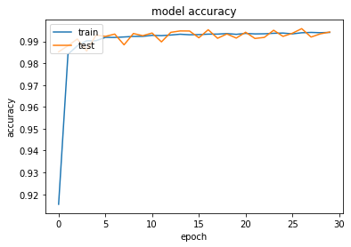
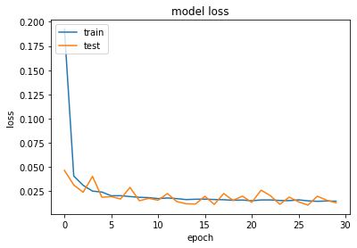
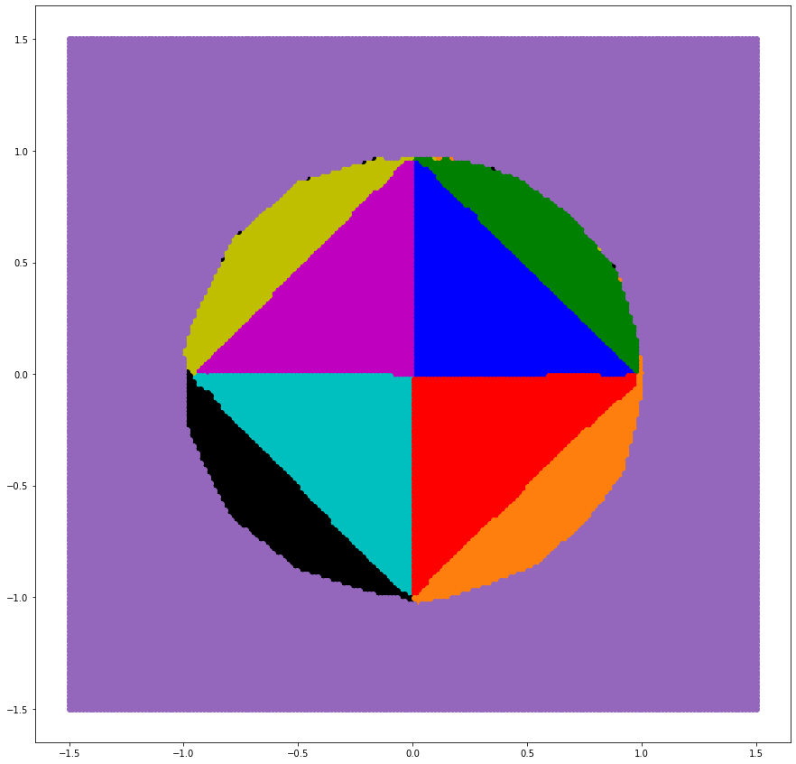
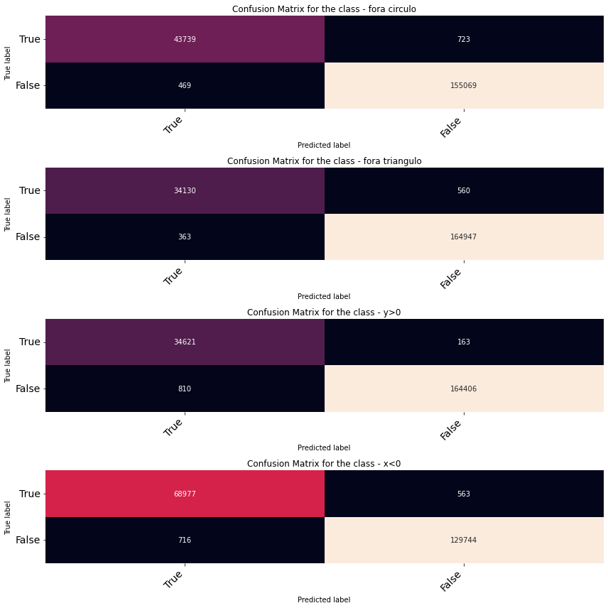

```python
import matplotlib.pyplot as plt
import math
import numpy as np
from sklearn.preprocessing import MinMaxScaler
import tensorflow
from tensorflow.keras.models import Sequential
from tensorflow.keras.optimizers import SGD
from tensorflow.keras.layers import Dense
from tensorflow.keras.utils import to_categorical
import sklearn.metrics as metrics
import seaborn as sns
import pandas as pd
```


```python
with open('data.npy', 'rb') as f:
    data = np.load(f)
    dataLabels = np.load(f)
testData = data[math.floor(len(data)*0.8):]
data = data[:math.floor(len(data)*0.8)]
testDataLabels = dataLabels[math.floor(len(dataLabels)*0.8):]
dataLabels = dataLabels[:math.floor(len(dataLabels)*0.8)]
dataset = tensorflow.data.Dataset.from_tensor_slices((data, dataLabels))
len(data)
```


    200000


```python
model = Sequential()
model.add(Dense(12, input_shape=(2,), kernel_initializer='normal', activation='relu'))
model.add(Dense(16, activation='sigmoid', kernel_initializer='normal'))
model.add(Dense(4, activation='sigmoid', kernel_initializer='normal'))
model.summary()
```

    Model: "sequential"
    _________________________________________________________________
     Layer (type)                Output Shape              Param #   
    =================================================================
     dense (Dense)               (None, 12)                36        
                                                                     
     dense_1 (Dense)             (None, 16)                208       
                                                                     
     dense_2 (Dense)             (None, 4)                 68        
                                                                     
    =================================================================
    Total params: 312
    Trainable params: 312
    Non-trainable params: 0
    _________________________________________________________________
    


```python
optimizer = SGD(learning_rate=0.1, momentum=0.9)
model.compile(loss='binary_crossentropy', optimizer=optimizer, metrics=['binary_accuracy']) 
history = model.fit(data, dataLabels, epochs=30, batch_size=50, verbose=1, validation_split = 0.2)
```

    Epoch 1/30
    3200/3200 [==============================] - 3s 856us/step - loss: 0.1928 - binary_accuracy: 0.9154 - val_loss: 0.0465 - val_binary_accuracy: 0.9852
    Epoch 2/30
    3200/3200 [==============================] - 2s 765us/step - loss: 0.0406 - binary_accuracy: 0.9841 - val_loss: 0.0314 - val_binary_accuracy: 0.9880
    Epoch 3/30
    3200/3200 [==============================] - 2s 764us/step - loss: 0.0310 - binary_accuracy: 0.9880 - val_loss: 0.0239 - val_binary_accuracy: 0.9911
    Epoch 4/30
    3200/3200 [==============================] - 2s 755us/step - loss: 0.0251 - binary_accuracy: 0.9903 - val_loss: 0.0403 - val_binary_accuracy: 0.9855
    Epoch 5/30
    3200/3200 [==============================] - 3s 820us/step - loss: 0.0241 - binary_accuracy: 0.9903 - val_loss: 0.0187 - val_binary_accuracy: 0.9929
    Epoch 6/30
    3200/3200 [==============================] - 2s 765us/step - loss: 0.0202 - binary_accuracy: 0.9918 - val_loss: 0.0194 - val_binary_accuracy: 0.9923
    Epoch 7/30
    3200/3200 [==============================] - 3s 790us/step - loss: 0.0203 - binary_accuracy: 0.9918 - val_loss: 0.0169 - val_binary_accuracy: 0.9933
    Epoch 8/30
    3200/3200 [==============================] - 2s 759us/step - loss: 0.0194 - binary_accuracy: 0.9920 - val_loss: 0.0289 - val_binary_accuracy: 0.9884
    Epoch 9/30
    3200/3200 [==============================] - 3s 791us/step - loss: 0.0187 - binary_accuracy: 0.9923 - val_loss: 0.0151 - val_binary_accuracy: 0.9936
    Epoch 10/30
    3200/3200 [==============================] - 2s 772us/step - loss: 0.0183 - binary_accuracy: 0.9923 - val_loss: 0.0176 - val_binary_accuracy: 0.9926
    Epoch 11/30
    3200/3200 [==============================] - 2s 765us/step - loss: 0.0173 - binary_accuracy: 0.9928 - val_loss: 0.0157 - val_binary_accuracy: 0.9938
    Epoch 12/30
    3200/3200 [==============================] - 3s 792us/step - loss: 0.0180 - binary_accuracy: 0.9926 - val_loss: 0.0225 - val_binary_accuracy: 0.9898
    Epoch 13/30
    3200/3200 [==============================] - 2s 752us/step - loss: 0.0173 - binary_accuracy: 0.9929 - val_loss: 0.0142 - val_binary_accuracy: 0.9941
    Epoch 14/30
    3200/3200 [==============================] - 3s 788us/step - loss: 0.0163 - binary_accuracy: 0.9933 - val_loss: 0.0120 - val_binary_accuracy: 0.9948
    Epoch 15/30
    3200/3200 [==============================] - 2s 768us/step - loss: 0.0167 - binary_accuracy: 0.9930 - val_loss: 0.0117 - val_binary_accuracy: 0.9947
    Epoch 16/30
    3200/3200 [==============================] - 2s 776us/step - loss: 0.0167 - binary_accuracy: 0.9931 - val_loss: 0.0197 - val_binary_accuracy: 0.9916
    Epoch 17/30
    3200/3200 [==============================] - 2s 767us/step - loss: 0.0164 - binary_accuracy: 0.9933 - val_loss: 0.0113 - val_binary_accuracy: 0.9953
    Epoch 18/30
    3200/3200 [==============================] - 2s 768us/step - loss: 0.0161 - binary_accuracy: 0.9933 - val_loss: 0.0226 - val_binary_accuracy: 0.9914
    Epoch 19/30
    3200/3200 [==============================] - 3s 796us/step - loss: 0.0156 - binary_accuracy: 0.9936 - val_loss: 0.0154 - val_binary_accuracy: 0.9934
    Epoch 20/30
    3200/3200 [==============================] - 3s 832us/step - loss: 0.0158 - binary_accuracy: 0.9932 - val_loss: 0.0199 - val_binary_accuracy: 0.9915
    Epoch 21/30
    3200/3200 [==============================] - 2s 778us/step - loss: 0.0151 - binary_accuracy: 0.9937 - val_loss: 0.0134 - val_binary_accuracy: 0.9942
    Epoch 22/30
    3200/3200 [==============================] - 3s 848us/step - loss: 0.0159 - binary_accuracy: 0.9934 - val_loss: 0.0261 - val_binary_accuracy: 0.9913
    Epoch 23/30
    3200/3200 [==============================] - 3s 819us/step - loss: 0.0159 - binary_accuracy: 0.9935 - val_loss: 0.0203 - val_binary_accuracy: 0.9918
    Epoch 24/30
    3200/3200 [==============================] - 3s 800us/step - loss: 0.0154 - binary_accuracy: 0.9937 - val_loss: 0.0115 - val_binary_accuracy: 0.9951
    Epoch 25/30
    3200/3200 [==============================] - 2s 777us/step - loss: 0.0152 - binary_accuracy: 0.9938 - val_loss: 0.0188 - val_binary_accuracy: 0.9923
    Epoch 26/30
    3200/3200 [==============================] - 3s 797us/step - loss: 0.0160 - binary_accuracy: 0.9934 - val_loss: 0.0140 - val_binary_accuracy: 0.9937
    Epoch 27/30
    3200/3200 [==============================] - 2s 780us/step - loss: 0.0150 - binary_accuracy: 0.9939 - val_loss: 0.0106 - val_binary_accuracy: 0.9958
    Epoch 28/30
    3200/3200 [==============================] - 2s 763us/step - loss: 0.0145 - binary_accuracy: 0.9941 - val_loss: 0.0197 - val_binary_accuracy: 0.9920
    Epoch 29/30
    3200/3200 [==============================] - 2s 772us/step - loss: 0.0148 - binary_accuracy: 0.9940 - val_loss: 0.0157 - val_binary_accuracy: 0.9934
    Epoch 30/30
    3200/3200 [==============================] - 2s 772us/step - loss: 0.0146 - binary_accuracy: 0.9941 - val_loss: 0.0130 - val_binary_accuracy: 0.9943
    


```python
plt.plot(history.history['binary_accuracy'])
plt.plot(history.history['val_binary_accuracy'])
plt.title('model accuracy')
plt.ylabel('accuracy')
plt.xlabel('epoch')
plt.legend(['train', 'test'], loc='upper left')
plt.show()
```


    

    


```python
# summarize history for loss
plt.plot(history.history['loss'])
plt.plot(history.history['val_loss'])
plt.title('model loss')
plt.ylabel('loss')
plt.xlabel('epoch')
plt.legend(['train', 'test'], loc='upper left')
plt.show()
```


    

    


```python
test_results = model.evaluate(testData, testDataLabels, verbose=1)
print(f'Test results - Loss: {test_results[0]} - Accuracy: {test_results[1]}%')
```

    1563/1563 [==============================] - 2s 911us/step - loss: 0.0126 - binary_accuracy: 0.9944
    Test results - Loss: 0.012582742609083652 - Accuracy: 0.9943900108337402%
    

### Test results - Loss: 0.006966711021959782 - Accuracy: 0.9974750280380249%


```python
testx = np.linspace(-1.5,1.5,200)
testy = np.linspace(-1.5,1.5,200)
dataTest=[]
for i in range(200):
  for j in range(200):
      dataTest.append([testx[i], testy[j]])  
prediction = []

prediction=(model.predict(np.array(dataTest)))
groupsTestx = [[],[],[],[],[],[],[],[],[]]
groupsTesty = [[],[],[],[],[],[],[],[], []]
for i in range(len(dataTest)):
    if(prediction[i][3]>=0.5):
        groupsTestx[8].append(dataTest[i][0])
        groupsTesty[8].append(dataTest[i][1])
    elif(prediction[i][0]>=0.5):
        if prediction[i][1] >= 0.5:
            if prediction[i][2]>=0.5:
                #111
                groupsTestx[6].append(dataTest[i][0])
                groupsTesty[6].append(dataTest[i][1])
            else:
                #110
                groupsTestx[7].append(dataTest[i][0])
                groupsTesty[7].append(dataTest[i][1])
        else:
            if prediction[i][2]>=0.5:
                #101
                groupsTestx[5].append(dataTest[i][0])
                groupsTesty[5].append(dataTest[i][1])
            else:
                #100
                groupsTestx[4].append(dataTest[i][0])
                groupsTesty[4].append(dataTest[i][1])
    else:
        if prediction[i][1] >= 0.5:
            if prediction[i][2]>=0.5:
                #011
                groupsTestx[2].append(dataTest[i][0])
                groupsTesty[2].append(dataTest[i][1])
            else:
                #010
                groupsTestx[3].append(dataTest[i][0])
                groupsTesty[3].append(dataTest[i][1])
        else:
            if prediction[i][2]>=0.5:
                #001
                groupsTestx[1].append(dataTest[i][0])
                groupsTesty[1].append(dataTest[i][1])
            else:
                #000
                groupsTestx[0].append(dataTest[i][0])
                groupsTesty[0].append(dataTest[i][1])
                
plt.rcParams['figure.figsize'] = [15, 15]
plt.scatter(groupsTestx[0],groupsTesty[0], c='b')
plt.scatter(groupsTestx[1],groupsTesty[1], c='m')
plt.scatter(groupsTestx[2],groupsTesty[2], c='c')
plt.scatter(groupsTestx[3],groupsTesty[3], c='r')
plt.scatter(groupsTestx[4],groupsTesty[4], c='g')
plt.scatter(groupsTestx[5],groupsTesty[5], c='y')
plt.scatter(groupsTestx[6],groupsTesty[6], c='k')
plt.scatter(groupsTestx[7],groupsTesty[7], c='tab:orange')
plt.scatter(groupsTestx[8],groupsTesty[8], c='tab:purple')
plt.show()
```


    

    


```python
testPrediction = model.predict(testData)

```


```python
labels = ["fora circulo","fora triangulo","y>0","x<0"]
cm = metrics.multilabel_confusion_matrix((testDataLabels>0.5), (testPrediction>0.5))
```


```python
def print_confusion_matrix(confusion_matrix, axes, class_label, class_names, fontsize=14):

    df_cm = pd.DataFrame(
        confusion_matrix, index=class_names, columns=class_names,
    )

    try:
        heatmap = sns.heatmap(df_cm, annot=True, fmt="d", cbar=False, ax=axes)
    except ValueError:
        raise ValueError("Confusion matrix values must be integers.")
    heatmap.yaxis.set_ticklabels(heatmap.yaxis.get_ticklabels(), rotation=0, ha='right', fontsize=fontsize)
    heatmap.xaxis.set_ticklabels(heatmap.xaxis.get_ticklabels(), rotation=45, ha='right', fontsize=fontsize)
    axes.set_ylabel('True label')
    axes.set_xlabel('Predicted label')
    axes.set_title("Confusion Matrix for the class - " + class_label)
    
fig, ax = plt.subplots(4, 1, figsize=(12, 12))
    
for axes, cfs_matrix, label in zip(ax.flatten(), cm, labels):
    print_confusion_matrix(cfs_matrix, axes, label, ["True", "False"])
    
fig.tight_layout()
plt.show()
```


    

    


```python

```
