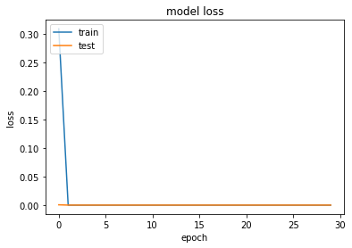
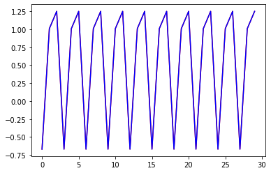
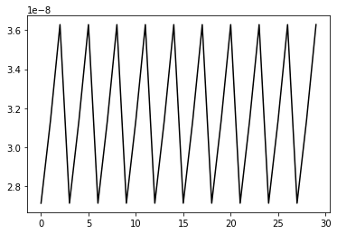

```python
import matplotlib.pyplot as plt
import math
import numpy as np
import tensorflow
from tensorflow.keras.models import Sequential
from tensorflow.keras.optimizers import SGD
from tensorflow.keras.layers import Dense
from tensorflow.keras.utils import to_categorical
```


```python
dataSize = 10000

def temporalFunction(n):
    return (math.sin(n)**2) + math.cos(n+ math.cos(n))
data = []
dataLabel = []
for i in range(dataSize):
    input=[]
    output=[]
    for j in range(10):
        input.append(temporalFunction(j))
    for k in range(3):
        output.append(temporalFunction(10+k))
    data.append(input)
    dataLabel.append(output)
data = np.array(data)
dataLabel = np.array(dataLabel)
```


```python
model = Sequential()
model.add(Dense(4, input_shape=(10,), kernel_initializer='normal', activation='relu'))
model.add(Dense(3, activation='linear', kernel_initializer='normal'))
model.summary()
```

    Model: "sequential"
    _________________________________________________________________
     Layer (type)                Output Shape              Param #   
    =================================================================
     dense (Dense)               (None, 4)                 44        
                                                                     
     dense_1 (Dense)             (None, 3)                 15        
                                                                     
    =================================================================
    Total params: 59
    Trainable params: 59
    Non-trainable params: 0
    _________________________________________________________________
    


```python
model.compile(loss='mean_squared_error', optimizer='adam', metrics=['mean_squared_error']) 
history = model.fit(data, dataLabel, epochs=30, batch_size=20, verbose=1,validation_split = 0.2)
```

    Epoch 1/30
    400/400 [==============================] - 1s 1ms/step - loss: 0.3095 - mean_squared_error: 0.3095 - val_loss: 5.1212e-04 - val_mean_squared_error: 5.1212e-04
    Epoch 2/30
    400/400 [==============================] - 0s 799us/step - loss: 3.9790e-05 - mean_squared_error: 3.9790e-05 - val_loss: 1.5936e-11 - val_mean_squared_error: 1.5936e-11
    Epoch 3/30
    400/400 [==============================] - 0s 759us/step - loss: 2.0150e-12 - mean_squared_error: 2.0150e-12 - val_loss: 1.4460e-12 - val_mean_squared_error: 1.4460e-12
    Epoch 4/30
    400/400 [==============================] - 0s 754us/step - loss: 1.2907e-12 - mean_squared_error: 1.2907e-12 - val_loss: 1.0338e-12 - val_mean_squared_error: 1.0338e-12
    Epoch 5/30
    400/400 [==============================] - 0s 762us/step - loss: 8.6340e-13 - mean_squared_error: 8.6340e-13 - val_loss: 6.4541e-13 - val_mean_squared_error: 6.4541e-13
    Epoch 6/30
    400/400 [==============================] - 0s 770us/step - loss: 5.3793e-13 - mean_squared_error: 5.3793e-13 - val_loss: 4.2277e-13 - val_mean_squared_error: 4.2277e-13
    Epoch 7/30
    400/400 [==============================] - 0s 749us/step - loss: 3.4007e-13 - mean_squared_error: 3.4007e-13 - val_loss: 2.4751e-13 - val_mean_squared_error: 2.4751e-13
    Epoch 8/30
    400/400 [==============================] - 0s 749us/step - loss: 2.0811e-13 - mean_squared_error: 2.0811e-13 - val_loss: 1.6224e-13 - val_mean_squared_error: 1.6224e-13
    Epoch 9/30
    400/400 [==============================] - 0s 882us/step - loss: 1.3608e-13 - mean_squared_error: 1.3608e-13 - val_loss: 9.5923e-14 - val_mean_squared_error: 9.5923e-14
    Epoch 10/30
    400/400 [==============================] - 0s 845us/step - loss: 8.3240e-14 - mean_squared_error: 8.3240e-14 - val_loss: 6.2765e-14 - val_mean_squared_error: 6.2765e-14
    Epoch 11/30
    400/400 [==============================] - 0s 817us/step - loss: 5.8679e-14 - mean_squared_error: 5.8679e-14 - val_loss: 4.8554e-14 - val_mean_squared_error: 4.8554e-14
    Epoch 12/30
    400/400 [==============================] - 0s 762us/step - loss: 2.5698e-14 - mean_squared_error: 2.5698e-14 - val_loss: 2.4869e-14 - val_mean_squared_error: 2.4869e-14
    Epoch 13/30
    400/400 [==============================] - 0s 752us/step - loss: 2.4869e-14 - mean_squared_error: 2.4869e-14 - val_loss: 2.4869e-14 - val_mean_squared_error: 2.4869e-14
    Epoch 14/30
    400/400 [==============================] - 0s 800us/step - loss: 1.1262e-14 - mean_squared_error: 1.1262e-14 - val_loss: 1.0658e-14 - val_mean_squared_error: 1.0658e-14
    Epoch 15/30
    400/400 [==============================] - 0s 747us/step - loss: 6.6554e-15 - mean_squared_error: 6.6554e-15 - val_loss: 5.9212e-15 - val_mean_squared_error: 5.9212e-15
    Epoch 16/30
    400/400 [==============================] - 0s 740us/step - loss: 5.9212e-15 - mean_squared_error: 5.9212e-15 - val_loss: 5.9212e-15 - val_mean_squared_error: 5.9212e-15
    Epoch 17/30
    400/400 [==============================] - 0s 747us/step - loss: 3.5290e-15 - mean_squared_error: 3.5290e-15 - val_loss: 1.1842e-15 - val_mean_squared_error: 1.1842e-15
    Epoch 18/30
    400/400 [==============================] - 0s 770us/step - loss: 1.1842e-15 - mean_squared_error: 1.1842e-15 - val_loss: 1.1842e-15 - val_mean_squared_error: 1.1842e-15
    Epoch 19/30
    400/400 [==============================] - 0s 753us/step - loss: 1.1842e-15 - mean_squared_error: 1.1842e-15 - val_loss: 1.1842e-15 - val_mean_squared_error: 1.1842e-15
    Epoch 20/30
    400/400 [==============================] - 0s 747us/step - loss: 1.1842e-15 - mean_squared_error: 1.1842e-15 - val_loss: 1.1842e-15 - val_mean_squared_error: 1.1842e-15
    Epoch 21/30
    400/400 [==============================] - 0s 805us/step - loss: 1.1842e-15 - mean_squared_error: 1.1842e-15 - val_loss: 1.1842e-15 - val_mean_squared_error: 1.1842e-15
    Epoch 22/30
    400/400 [==============================] - 0s 745us/step - loss: 1.1842e-15 - mean_squared_error: 1.1842e-15 - val_loss: 1.1842e-15 - val_mean_squared_error: 1.1842e-15
    Epoch 23/30
    400/400 [==============================] - 0s 747us/step - loss: 1.1842e-15 - mean_squared_error: 1.1842e-15 - val_loss: 1.1842e-15 - val_mean_squared_error: 1.1842e-15
    Epoch 24/30
    400/400 [==============================] - 0s 762us/step - loss: 2.9606e-17 - mean_squared_error: 2.9606e-17 - val_loss: 0.0000e+00 - val_mean_squared_error: 0.0000e+00
    Epoch 25/30
    400/400 [==============================] - 0s 805us/step - loss: 0.0000e+00 - mean_squared_error: 0.0000e+00 - val_loss: 0.0000e+00 - val_mean_squared_error: 0.0000e+00
    Epoch 26/30
    400/400 [==============================] - 0s 752us/step - loss: 0.0000e+00 - mean_squared_error: 0.0000e+00 - val_loss: 0.0000e+00 - val_mean_squared_error: 0.0000e+00
    Epoch 27/30
    400/400 [==============================] - 0s 767us/step - loss: 0.0000e+00 - mean_squared_error: 0.0000e+00 - val_loss: 0.0000e+00 - val_mean_squared_error: 0.0000e+00
    Epoch 28/30
    400/400 [==============================] - 0s 900us/step - loss: 0.0000e+00 - mean_squared_error: 0.0000e+00 - val_loss: 0.0000e+00 - val_mean_squared_error: 0.0000e+00
    Epoch 29/30
    400/400 [==============================] - 0s 777us/step - loss: 0.0000e+00 - mean_squared_error: 0.0000e+00 - val_loss: 0.0000e+00 - val_mean_squared_error: 0.0000e+00
    Epoch 30/30
    400/400 [==============================] - 0s 750us/step - loss: 0.0000e+00 - mean_squared_error: 0.0000e+00 - val_loss: 0.0000e+00 - val_mean_squared_error: 0.0000e+00
    


```python
# summarize history for loss
plt.plot(history.history['loss'])
plt.plot(history.history['val_loss'])
plt.title('model loss')
plt.ylabel('loss')
plt.xlabel('epoch')
plt.legend(['train', 'test'], loc='upper left')
plt.show()
```


    

    


```python
offset = 237498528
validationData=[]
validationLabel=[]
for i in range(0,30,3):
    input=[]
    output=[]
    for j in range(10):
        input.append(temporalFunction(j))
    for k in range(3):
        output.append(temporalFunction(10+k))
    validationData.append(input)
    validationLabel.append(output)
validationData = np.array(validationData)
validationLabel = np.array(validationLabel)
ypredict = (model.predict(validationData)).flatten()
y = validationLabel.flatten()
plt.plot(ypredict, 'r', ls = '-')
plt.plot(y, 'b', ls = '-')
plt.show()
```


    

    


```python
validationAbsoluteError = np.absolute(y-ypredict)
plt.plot(validationAbsoluteError, 'k', ls = '-')
plt.show()
```


    

    


```python

```
