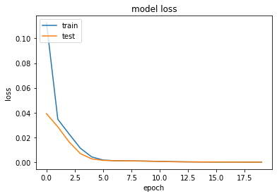
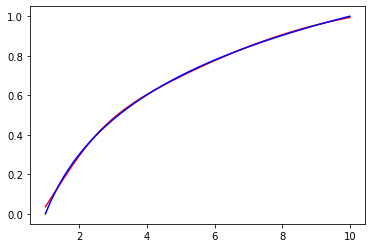

```python
import numpy as np
import math
import random
import matplotlib.pyplot as plt
import tensorflow
from tensorflow.keras.models import Sequential
from tensorflow.keras.layers import Dense
from tensorflow.keras.utils import to_categorical
```


```python
inputs=[]
outputs=[]
dataSize = 5000
for i in range(dataSize):
        x = random.uniform(1, 10)
        inputs.append([x])
        outputs.append([math.log(x, 10)])
trainingSet = np.array(inputs[:math.floor(len(inputs)*0.8)])
trainingLabels = np.array(outputs[:math.floor(len(outputs)*0.8)])
testingSet = np.array(inputs[math.floor(len(inputs)*0.8):])
testingLabels = np.array(outputs[math.floor(len(outputs)*0.8):])
```


```python
model = Sequential()
model.add(Dense(2, input_shape=(1,), kernel_initializer='normal', activation='sigmoid'))
model.add(Dense(1, activation='linear', kernel_initializer='normal'))
model.summary()
```

    Model: "sequential"
    _________________________________________________________________
     Layer (type)                Output Shape              Param #   
    =================================================================
     dense (Dense)               (None, 2)                 4         
                                                                     
     dense_1 (Dense)             (None, 1)                 3         
                                                                     
    =================================================================
    Total params: 7
    Trainable params: 7
    Non-trainable params: 0
    _________________________________________________________________
    


```python
model.compile(loss='mean_squared_error', optimizer='adam', metrics=['mean_squared_error']) 
history = model.fit(trainingSet, trainingLabels, epochs=20, batch_size=5, verbose=1,validation_split = 0.2)
```

    Epoch 1/20
    640/640 [==============================] - 1s 1ms/step - loss: 0.1127 - mean_squared_error: 0.1127 - val_loss: 0.0392 - val_mean_squared_error: 0.0392
    Epoch 2/20
    640/640 [==============================] - 1s 989us/step - loss: 0.0346 - mean_squared_error: 0.0346 - val_loss: 0.0285 - val_mean_squared_error: 0.0285
    Epoch 3/20
    640/640 [==============================] - 1s 1ms/step - loss: 0.0227 - mean_squared_error: 0.0227 - val_loss: 0.0163 - val_mean_squared_error: 0.0163
    Epoch 4/20
    640/640 [==============================] - 1s 955us/step - loss: 0.0112 - mean_squared_error: 0.0112 - val_loss: 0.0068 - val_mean_squared_error: 0.0068
    Epoch 5/20
    640/640 [==============================] - 1s 814us/step - loss: 0.0042 - mean_squared_error: 0.0042 - val_loss: 0.0026 - val_mean_squared_error: 0.0026
    Epoch 6/20
    640/640 [==============================] - 1s 784us/step - loss: 0.0017 - mean_squared_error: 0.0017 - val_loss: 0.0015 - val_mean_squared_error: 0.0015
    Epoch 7/20
    640/640 [==============================] - 0s 776us/step - loss: 0.0011 - mean_squared_error: 0.0011 - val_loss: 0.0011 - val_mean_squared_error: 0.0011
    Epoch 8/20
    640/640 [==============================] - 0s 744us/step - loss: 9.9852e-04 - mean_squared_error: 9.9852e-04 - val_loss: 0.0011 - val_mean_squared_error: 0.0011
    Epoch 9/20
    640/640 [==============================] - 0s 747us/step - loss: 9.3929e-04 - mean_squared_error: 9.3929e-04 - val_loss: 9.8771e-04 - val_mean_squared_error: 9.8771e-04
    Epoch 10/20
    640/640 [==============================] - 0s 733us/step - loss: 8.1898e-04 - mean_squared_error: 8.1898e-04 - val_loss: 7.8336e-04 - val_mean_squared_error: 7.8336e-04
    Epoch 11/20
    640/640 [==============================] - 1s 786us/step - loss: 6.1115e-04 - mean_squared_error: 6.1115e-04 - val_loss: 5.8364e-04 - val_mean_squared_error: 5.8364e-04
    Epoch 12/20
    640/640 [==============================] - 1s 848us/step - loss: 4.1642e-04 - mean_squared_error: 4.1642e-04 - val_loss: 3.7297e-04 - val_mean_squared_error: 3.7297e-04
    Epoch 13/20
    640/640 [==============================] - 1s 1ms/step - loss: 2.7522e-04 - mean_squared_error: 2.7522e-04 - val_loss: 2.4173e-04 - val_mean_squared_error: 2.4173e-04
    Epoch 14/20
    640/640 [==============================] - 1s 872us/step - loss: 1.7672e-04 - mean_squared_error: 1.7672e-04 - val_loss: 1.5515e-04 - val_mean_squared_error: 1.5515e-04
    Epoch 15/20
    640/640 [==============================] - 1s 914us/step - loss: 1.1291e-04 - mean_squared_error: 1.1291e-04 - val_loss: 1.0019e-04 - val_mean_squared_error: 1.0019e-04
    Epoch 16/20
    640/640 [==============================] - 1s 892us/step - loss: 7.4505e-05 - mean_squared_error: 7.4505e-05 - val_loss: 6.9045e-05 - val_mean_squared_error: 6.9045e-05
    Epoch 17/20
    640/640 [==============================] - 1s 875us/step - loss: 5.4495e-05 - mean_squared_error: 5.4495e-05 - val_loss: 5.2477e-05 - val_mean_squared_error: 5.2477e-05
    Epoch 18/20
    640/640 [==============================] - 1s 884us/step - loss: 4.1269e-05 - mean_squared_error: 4.1269e-05 - val_loss: 3.7826e-05 - val_mean_squared_error: 3.7826e-05
    Epoch 19/20
    640/640 [==============================] - 1s 866us/step - loss: 3.3760e-05 - mean_squared_error: 3.3760e-05 - val_loss: 3.1946e-05 - val_mean_squared_error: 3.1946e-05
    Epoch 20/20
    640/640 [==============================] - 1s 909us/step - loss: 2.9920e-05 - mean_squared_error: 2.9920e-05 - val_loss: 2.7895e-05 - val_mean_squared_error: 2.7895e-05
    


```python
test_results = model.evaluate(testingSet, testingLabels, verbose=1)
print(f'Test results - Loss: {test_results[0]} - Accuracy: {test_results[1]}%')
```

    32/32 [==============================] - 0s 1ms/step - loss: 2.3525e-05 - mean_squared_error: 2.3525e-05
    Test results - Loss: 2.3524600692326203e-05 - Accuracy: 2.3524600692326203e-05%
    

### Test results - Loss: 2.934691474365536e-05


```python
# summarize history for loss
plt.plot(history.history['loss'])
plt.plot(history.history['val_loss'])
plt.title('model loss')
plt.ylabel('loss')
plt.xlabel('epoch')
plt.legend(['train', 'test'], loc='upper left')
plt.show()
```


    

    


```python
x = np.linspace(1,10,100)
ypredict = (model.predict(x))
y = np.log10(x)
plt.plot(x,ypredict, 'r', ls = '-')
plt.plot(x,y, 'b', ls = '-')
plt.show()
```


    

    

