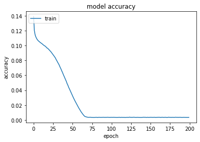
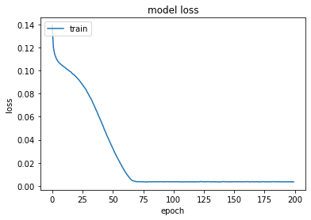
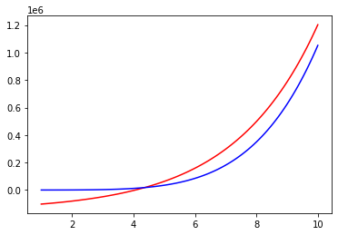

```python
import numpy as np
from sklearn.preprocessing import MinMaxScaler
import math
import random
import matplotlib.pyplot as plt
import tensorflow
from tensorflow.keras.models import Sequential
from tensorflow.keras.layers import Dense
from tensorflow.keras.utils import to_categorical
```


```python
inputs=[]
outputs=[]
scaler = MinMaxScaler()
def sourceFunction(x):
    return (10*math.pow(x,5))+(5*math.pow(x,4))+(2*math.pow(x,3))-(0.5*math.pow(x,2))+(3*x)+2

dataSize = 5000
scaler = MinMaxScaler()
inputs = np.linspace(0,20,dataSize)
np.random.shuffle(inputs)
for i in range(len(inputs)):
        outputs.append(sourceFunction(inputs[i]))
outputs = scaler.fit_transform(np.array(outputs).reshape(-1, 1)).flatten()
trainingSet = np.array(inputs[:math.floor(len(inputs)*0.8)])
trainingLabels = np.array(outputs[:math.floor(len(outputs)*0.8)])
testingSet = np.array(inputs[math.floor(len(inputs)*0.8):])
testingLabels = np.array(outputs[math.floor(len(outputs)*0.8):])
```


```python
model = Sequential()
model.add(Dense(2, input_shape=(1,), kernel_initializer='normal', activation='sigmoid'))
model.add(Dense(1, activation='linear', kernel_initializer='normal'))
model.summary()
```

    Model: "sequential"
    _________________________________________________________________
     Layer (type)                Output Shape              Param #   
    =================================================================
     dense (Dense)               (None, 2)                 4         
                                                                     
     dense_1 (Dense)             (None, 1)                 3         
                                                                     
    =================================================================
    Total params: 7
    Trainable params: 7
    Non-trainable params: 0
    _________________________________________________________________
    


```python
model.compile(loss='mean_absolute_error', optimizer='adam', metrics=['mean_absolute_error']) 
history = model.fit(trainingSet, trainingLabels, epochs=200, batch_size=5, verbose=1)
```

    Epoch 1/200
    800/800 [==============================] - 1s 678us/step - loss: 0.1389 - mean_absolute_error: 0.1389
    Epoch 2/200
    800/800 [==============================] - 1s 685us/step - loss: 0.1201 - mean_absolute_error: 0.1201
    Epoch 3/200
    800/800 [==============================] - 1s 656us/step - loss: 0.1143 - mean_absolute_error: 0.1143
    Epoch 4/200
    800/800 [==============================] - 0s 612us/step - loss: 0.1113 - mean_absolute_error: 0.1113
    Epoch 5/200
    800/800 [==============================] - 0s 617us/step - loss: 0.1092 - mean_absolute_error: 0.1092
    Epoch 6/200
    800/800 [==============================] - 0s 610us/step - loss: 0.1076 - mean_absolute_error: 0.1076
    Epoch 7/200
    800/800 [==============================] - 0s 613us/step - loss: 0.1064 - mean_absolute_error: 0.1064
    Epoch 8/200
    800/800 [==============================] - 0s 615us/step - loss: 0.1054 - mean_absolute_error: 0.1054
    Epoch 9/200
    800/800 [==============================] - 0s 603us/step - loss: 0.1046 - mean_absolute_error: 0.1046
    Epoch 10/200
    800/800 [==============================] - 0s 603us/step - loss: 0.1037 - mean_absolute_error: 0.1037
    Epoch 11/200
    800/800 [==============================] - 0s 606us/step - loss: 0.1030 - mean_absolute_error: 0.1030
    Epoch 12/200
    800/800 [==============================] - 0s 618us/step - loss: 0.1022 - mean_absolute_error: 0.1022
    Epoch 13/200
    800/800 [==============================] - 0s 615us/step - loss: 0.1012 - mean_absolute_error: 0.1012
    Epoch 14/200
    800/800 [==============================] - 0s 608us/step - loss: 0.1005 - mean_absolute_error: 0.1005
    Epoch 15/200
    800/800 [==============================] - 1s 640us/step - loss: 0.0996 - mean_absolute_error: 0.0996
    Epoch 16/200
    800/800 [==============================] - 1s 640us/step - loss: 0.0991 - mean_absolute_error: 0.0991
    Epoch 17/200
    800/800 [==============================] - 1s 680us/step - loss: 0.0981 - mean_absolute_error: 0.0981
    Epoch 18/200
    800/800 [==============================] - 1s 696us/step - loss: 0.0967 - mean_absolute_error: 0.0967
    Epoch 19/200
    800/800 [==============================] - 1s 724us/step - loss: 0.0964 - mean_absolute_error: 0.0964
    Epoch 20/200
    800/800 [==============================] - 1s 641us/step - loss: 0.0952 - mean_absolute_error: 0.0952
    Epoch 21/200
    800/800 [==============================] - 1s 662us/step - loss: 0.0942 - mean_absolute_error: 0.0942
    Epoch 22/200
    800/800 [==============================] - 1s 689us/step - loss: 0.0930 - mean_absolute_error: 0.0930
    Epoch 23/200
    800/800 [==============================] - 1s 649us/step - loss: 0.0919 - mean_absolute_error: 0.0919
    Epoch 24/200
    800/800 [==============================] - 0s 605us/step - loss: 0.0906 - mean_absolute_error: 0.0906
    Epoch 25/200
    800/800 [==============================] - 0s 603us/step - loss: 0.0891 - mean_absolute_error: 0.0891
    Epoch 26/200
    800/800 [==============================] - 0s 602us/step - loss: 0.0877 - mean_absolute_error: 0.0877
    Epoch 27/200
    800/800 [==============================] - 0s 605us/step - loss: 0.0862 - mean_absolute_error: 0.0862
    Epoch 28/200
    800/800 [==============================] - 0s 608us/step - loss: 0.0848 - mean_absolute_error: 0.0848
    Epoch 29/200
    800/800 [==============================] - 0s 598us/step - loss: 0.0832 - mean_absolute_error: 0.0832
    Epoch 30/200
    800/800 [==============================] - 0s 603us/step - loss: 0.0810 - mean_absolute_error: 0.0810
    Epoch 31/200
    800/800 [==============================] - 0s 612us/step - loss: 0.0792 - mean_absolute_error: 0.0792
    Epoch 32/200
    800/800 [==============================] - 0s 616us/step - loss: 0.0772 - mean_absolute_error: 0.0772
    Epoch 33/200
    800/800 [==============================] - 1s 644us/step - loss: 0.0754 - mean_absolute_error: 0.0754
    Epoch 34/200
    800/800 [==============================] - 1s 658us/step - loss: 0.0734 - mean_absolute_error: 0.0734
    Epoch 35/200
    800/800 [==============================] - 0s 607us/step - loss: 0.0709 - mean_absolute_error: 0.0709
    Epoch 36/200
    800/800 [==============================] - 0s 603us/step - loss: 0.0688 - mean_absolute_error: 0.0688
    Epoch 37/200
    800/800 [==============================] - 0s 617us/step - loss: 0.0662 - mean_absolute_error: 0.0662
    Epoch 38/200
    800/800 [==============================] - 0s 598us/step - loss: 0.0640 - mean_absolute_error: 0.0640
    Epoch 39/200
    800/800 [==============================] - 0s 598us/step - loss: 0.0614 - mean_absolute_error: 0.0614
    Epoch 40/200
    800/800 [==============================] - 0s 596us/step - loss: 0.0590 - mean_absolute_error: 0.0590
    Epoch 41/200
    800/800 [==============================] - 0s 601us/step - loss: 0.0566 - mean_absolute_error: 0.0566
    Epoch 42/200
    800/800 [==============================] - 0s 613us/step - loss: 0.0542 - mean_absolute_error: 0.0542
    Epoch 43/200
    800/800 [==============================] - 0s 618us/step - loss: 0.0518 - mean_absolute_error: 0.0518
    Epoch 44/200
    800/800 [==============================] - 1s 677us/step - loss: 0.0488 - mean_absolute_error: 0.0488
    Epoch 45/200
    800/800 [==============================] - 1s 667us/step - loss: 0.0467 - mean_absolute_error: 0.0467
    Epoch 46/200
    800/800 [==============================] - 1s 645us/step - loss: 0.0439 - mean_absolute_error: 0.0439
    Epoch 47/200
    800/800 [==============================] - 1s 650us/step - loss: 0.0417 - mean_absolute_error: 0.0417
    Epoch 48/200
    800/800 [==============================] - 1s 650us/step - loss: 0.0394 - mean_absolute_error: 0.0394
    Epoch 49/200
    800/800 [==============================] - 1s 635us/step - loss: 0.0370 - mean_absolute_error: 0.0370
    Epoch 50/200
    800/800 [==============================] - 0s 591us/step - loss: 0.0346 - mean_absolute_error: 0.0346
    Epoch 51/200
    800/800 [==============================] - 1s 665us/step - loss: 0.0323 - mean_absolute_error: 0.0323
    Epoch 52/200
    800/800 [==============================] - 0s 601us/step - loss: 0.0301 - mean_absolute_error: 0.0301
    Epoch 53/200
    800/800 [==============================] - 1s 692us/step - loss: 0.0279 - mean_absolute_error: 0.0279
    Epoch 54/200
    800/800 [==============================] - 1s 657us/step - loss: 0.0258 - mean_absolute_error: 0.0258
    Epoch 55/200
    800/800 [==============================] - 1s 661us/step - loss: 0.0238 - mean_absolute_error: 0.0238
    Epoch 56/200
    800/800 [==============================] - 1s 648us/step - loss: 0.0218 - mean_absolute_error: 0.0218
    Epoch 57/200
    800/800 [==============================] - 1s 641us/step - loss: 0.0198 - mean_absolute_error: 0.0198
    Epoch 58/200
    800/800 [==============================] - 1s 656us/step - loss: 0.0180 - mean_absolute_error: 0.0180
    Epoch 59/200
    800/800 [==============================] - 1s 680us/step - loss: 0.0161 - mean_absolute_error: 0.0161
    Epoch 60/200
    800/800 [==============================] - 1s 699us/step - loss: 0.0144 - mean_absolute_error: 0.0144
    Epoch 61/200
    800/800 [==============================] - 1s 663us/step - loss: 0.0126 - mean_absolute_error: 0.0126
    Epoch 62/200
    800/800 [==============================] - 1s 691us/step - loss: 0.0109 - mean_absolute_error: 0.0109
    Epoch 63/200
    800/800 [==============================] - 1s 720us/step - loss: 0.0094 - mean_absolute_error: 0.0094
    Epoch 64/200
    800/800 [==============================] - 1s 760us/step - loss: 0.0080 - mean_absolute_error: 0.0080
    Epoch 65/200
    800/800 [==============================] - 1s 735us/step - loss: 0.0067 - mean_absolute_error: 0.0067
    Epoch 66/200
    800/800 [==============================] - 0s 617us/step - loss: 0.0055 - mean_absolute_error: 0.0055
    Epoch 67/200
    800/800 [==============================] - 1s 635us/step - loss: 0.0047 - mean_absolute_error: 0.0047
    Epoch 68/200
    800/800 [==============================] - 0s 611us/step - loss: 0.0044 - mean_absolute_error: 0.0044
    Epoch 69/200
    800/800 [==============================] - 0s 601us/step - loss: 0.0041 - mean_absolute_error: 0.0041
    Epoch 70/200
    800/800 [==============================] - 0s 610us/step - loss: 0.0038 - mean_absolute_error: 0.0038
    Epoch 71/200
    800/800 [==============================] - 0s 613us/step - loss: 0.0037 - mean_absolute_error: 0.0037
    Epoch 72/200
    800/800 [==============================] - 0s 608us/step - loss: 0.0037 - mean_absolute_error: 0.0037
    Epoch 73/200
    800/800 [==============================] - 0s 601us/step - loss: 0.0037 - mean_absolute_error: 0.0037
    Epoch 74/200
    800/800 [==============================] - 0s 603us/step - loss: 0.0037 - mean_absolute_error: 0.0037
    Epoch 75/200
    800/800 [==============================] - 0s 611us/step - loss: 0.0036 - mean_absolute_error: 0.0036
    Epoch 76/200
    800/800 [==============================] - 0s 612us/step - loss: 0.0036 - mean_absolute_error: 0.0036
    Epoch 77/200
    800/800 [==============================] - 0s 599us/step - loss: 0.0035 - mean_absolute_error: 0.0035
    Epoch 78/200
    800/800 [==============================] - 0s 616us/step - loss: 0.0036 - mean_absolute_error: 0.0036
    Epoch 79/200
    800/800 [==============================] - 0s 601us/step - loss: 0.0035 - mean_absolute_error: 0.0035
    Epoch 80/200
    800/800 [==============================] - 0s 610us/step - loss: 0.0036 - mean_absolute_error: 0.0036
    Epoch 81/200
    800/800 [==============================] - 0s 606us/step - loss: 0.0037 - mean_absolute_error: 0.0037
    Epoch 82/200
    800/800 [==============================] - 0s 623us/step - loss: 0.0037 - mean_absolute_error: 0.0037
    Epoch 83/200
    800/800 [==============================] - 0s 610us/step - loss: 0.0035 - mean_absolute_error: 0.0035
    Epoch 84/200
    800/800 [==============================] - 1s 645us/step - loss: 0.0037 - mean_absolute_error: 0.0037
    Epoch 85/200
    800/800 [==============================] - 0s 611us/step - loss: 0.0037 - mean_absolute_error: 0.0037
    Epoch 86/200
    800/800 [==============================] - 0s 613us/step - loss: 0.0036 - mean_absolute_error: 0.0036
    Epoch 87/200
    800/800 [==============================] - 0s 611us/step - loss: 0.0036 - mean_absolute_error: 0.0036
    Epoch 88/200
    800/800 [==============================] - 0s 615us/step - loss: 0.0036 - mean_absolute_error: 0.0036
    Epoch 89/200
    800/800 [==============================] - 0s 612us/step - loss: 0.0037 - mean_absolute_error: 0.0037
    Epoch 90/200
    800/800 [==============================] - 0s 615us/step - loss: 0.0037 - mean_absolute_error: 0.0037
    Epoch 91/200
    800/800 [==============================] - 0s 608us/step - loss: 0.0037 - mean_absolute_error: 0.0037
    Epoch 92/200
    800/800 [==============================] - 0s 620us/step - loss: 0.0036 - mean_absolute_error: 0.0036
    Epoch 93/200
    800/800 [==============================] - 0s 607us/step - loss: 0.0037 - mean_absolute_error: 0.0037
    Epoch 94/200
    800/800 [==============================] - 1s 635us/step - loss: 0.0036 - mean_absolute_error: 0.0036
    Epoch 95/200
    800/800 [==============================] - 0s 600us/step - loss: 0.0037 - mean_absolute_error: 0.0037
    Epoch 96/200
    800/800 [==============================] - 1s 657us/step - loss: 0.0037 - mean_absolute_error: 0.0037
    Epoch 97/200
    800/800 [==============================] - 1s 656us/step - loss: 0.0037 - mean_absolute_error: 0.0037
    Epoch 98/200
    800/800 [==============================] - 0s 608us/step - loss: 0.0036 - mean_absolute_error: 0.0036
    Epoch 99/200
    800/800 [==============================] - 0s 594us/step - loss: 0.0036 - mean_absolute_error: 0.0036
    Epoch 100/200
    800/800 [==============================] - 1s 646us/step - loss: 0.0037 - mean_absolute_error: 0.0037
    Epoch 101/200
    800/800 [==============================] - 0s 602us/step - loss: 0.0036 - mean_absolute_error: 0.0036
    Epoch 102/200
    800/800 [==============================] - 0s 620us/step - loss: 0.0037 - mean_absolute_error: 0.0037
    Epoch 103/200
    800/800 [==============================] - 0s 605us/step - loss: 0.0036 - mean_absolute_error: 0.0036
    Epoch 104/200
    800/800 [==============================] - 0s 606us/step - loss: 0.0037 - mean_absolute_error: 0.0037
    Epoch 105/200
    800/800 [==============================] - 0s 601us/step - loss: 0.0036 - mean_absolute_error: 0.0036
    Epoch 106/200
    800/800 [==============================] - 0s 603us/step - loss: 0.0036 - mean_absolute_error: 0.0036
    Epoch 107/200
    800/800 [==============================] - 0s 603us/step - loss: 0.0035 - mean_absolute_error: 0.0035
    Epoch 108/200
    800/800 [==============================] - 0s 601us/step - loss: 0.0036 - mean_absolute_error: 0.0036
    Epoch 109/200
    800/800 [==============================] - 0s 598us/step - loss: 0.0036 - mean_absolute_error: 0.0036
    Epoch 110/200
    800/800 [==============================] - 0s 607us/step - loss: 0.0036 - mean_absolute_error: 0.0036
    Epoch 111/200
    800/800 [==============================] - 0s 608us/step - loss: 0.0037 - mean_absolute_error: 0.0037
    Epoch 112/200
    800/800 [==============================] - 0s 601us/step - loss: 0.0036 - mean_absolute_error: 0.0036
    Epoch 113/200
    800/800 [==============================] - 0s 613us/step - loss: 0.0035 - mean_absolute_error: 0.0035
    Epoch 114/200
    800/800 [==============================] - 0s 612us/step - loss: 0.0037 - mean_absolute_error: 0.0037
    Epoch 115/200
    800/800 [==============================] - 0s 609us/step - loss: 0.0036 - mean_absolute_error: 0.0036
    Epoch 116/200
    800/800 [==============================] - 0s 607us/step - loss: 0.0036 - mean_absolute_error: 0.0036
    Epoch 117/200
    800/800 [==============================] - 0s 607us/step - loss: 0.0036 - mean_absolute_error: 0.0036
    Epoch 118/200
    800/800 [==============================] - 0s 603us/step - loss: 0.0035 - mean_absolute_error: 0.0035
    Epoch 119/200
    800/800 [==============================] - 0s 612us/step - loss: 0.0035 - mean_absolute_error: 0.0035
    Epoch 120/200
    800/800 [==============================] - 0s 606us/step - loss: 0.0036 - mean_absolute_error: 0.0036
    Epoch 121/200
    800/800 [==============================] - 1s 627us/step - loss: 0.0037 - mean_absolute_error: 0.0037
    Epoch 122/200
    800/800 [==============================] - 0s 609us/step - loss: 0.0036 - mean_absolute_error: 0.0036
    Epoch 123/200
    800/800 [==============================] - 1s 629us/step - loss: 0.0036 - mean_absolute_error: 0.0036
    Epoch 124/200
    800/800 [==============================] - 0s 612us/step - loss: 0.0039 - mean_absolute_error: 0.0039
    Epoch 125/200
    800/800 [==============================] - 1s 632us/step - loss: 0.0036 - mean_absolute_error: 0.0036
    Epoch 126/200
    800/800 [==============================] - 1s 630us/step - loss: 0.0037 - mean_absolute_error: 0.0037
    Epoch 127/200
    800/800 [==============================] - 0s 602us/step - loss: 0.0035 - mean_absolute_error: 0.0035
    Epoch 128/200
    800/800 [==============================] - 0s 608us/step - loss: 0.0037 - mean_absolute_error: 0.0037
    Epoch 129/200
    800/800 [==============================] - 1s 711us/step - loss: 0.0037 - mean_absolute_error: 0.0037
    Epoch 130/200
    800/800 [==============================] - 1s 642us/step - loss: 0.0037 - mean_absolute_error: 0.0037
    Epoch 131/200
    800/800 [==============================] - 0s 621us/step - loss: 0.0036 - mean_absolute_error: 0.0036
    Epoch 132/200
    800/800 [==============================] - 0s 603us/step - loss: 0.0036 - mean_absolute_error: 0.0036
    Epoch 133/200
    800/800 [==============================] - 0s 619us/step - loss: 0.0036 - mean_absolute_error: 0.0036
    Epoch 134/200
    800/800 [==============================] - 0s 602us/step - loss: 0.0037 - mean_absolute_error: 0.0037
    Epoch 135/200
    800/800 [==============================] - 0s 605us/step - loss: 0.0036 - mean_absolute_error: 0.0036
    Epoch 136/200
    800/800 [==============================] - 0s 596us/step - loss: 0.0036 - mean_absolute_error: 0.0036
    Epoch 137/200
    800/800 [==============================] - 0s 615us/step - loss: 0.0037 - mean_absolute_error: 0.0037
    Epoch 138/200
    800/800 [==============================] - 1s 794us/step - loss: 0.0036 - mean_absolute_error: 0.0036
    Epoch 139/200
    800/800 [==============================] - 1s 765us/step - loss: 0.0035 - mean_absolute_error: 0.0035
    Epoch 140/200
    800/800 [==============================] - 0s 611us/step - loss: 0.0036 - mean_absolute_error: 0.0036
    Epoch 141/200
    800/800 [==============================] - 0s 615us/step - loss: 0.0036 - mean_absolute_error: 0.0036
    Epoch 142/200
    800/800 [==============================] - 0s 616us/step - loss: 0.0038 - mean_absolute_error: 0.0038
    Epoch 143/200
    800/800 [==============================] - 0s 615us/step - loss: 0.0037 - mean_absolute_error: 0.0037
    Epoch 144/200
    800/800 [==============================] - 0s 624us/step - loss: 0.0037 - mean_absolute_error: 0.0037
    Epoch 145/200
    800/800 [==============================] - 0s 605us/step - loss: 0.0036 - mean_absolute_error: 0.0036
    Epoch 146/200
    800/800 [==============================] - 0s 616us/step - loss: 0.0036 - mean_absolute_error: 0.0036
    Epoch 147/200
    800/800 [==============================] - 0s 608us/step - loss: 0.0037 - mean_absolute_error: 0.0037
    Epoch 148/200
    800/800 [==============================] - 0s 604us/step - loss: 0.0036 - mean_absolute_error: 0.0036
    Epoch 149/200
    800/800 [==============================] - 1s 672us/step - loss: 0.0036 - mean_absolute_error: 0.0036
    Epoch 150/200
    800/800 [==============================] - 1s 634us/step - loss: 0.0036 - mean_absolute_error: 0.0036
    Epoch 151/200
    800/800 [==============================] - 0s 612us/step - loss: 0.0037 - mean_absolute_error: 0.0037
    Epoch 152/200
    800/800 [==============================] - 0s 606us/step - loss: 0.0037 - mean_absolute_error: 0.0037
    Epoch 153/200
    800/800 [==============================] - 0s 617us/step - loss: 0.0036 - mean_absolute_error: 0.0036
    Epoch 154/200
    800/800 [==============================] - 0s 616us/step - loss: 0.0036 - mean_absolute_error: 0.0036
    Epoch 155/200
    800/800 [==============================] - 0s 612us/step - loss: 0.0037 - mean_absolute_error: 0.0037
    Epoch 156/200
    800/800 [==============================] - 0s 600us/step - loss: 0.0037 - mean_absolute_error: 0.0037
    Epoch 157/200
    800/800 [==============================] - 0s 611us/step - loss: 0.0035 - mean_absolute_error: 0.0035
    Epoch 158/200
    800/800 [==============================] - 0s 607us/step - loss: 0.0037 - mean_absolute_error: 0.0037
    Epoch 159/200
    800/800 [==============================] - 0s 608us/step - loss: 0.0036 - mean_absolute_error: 0.0036
    Epoch 160/200
    800/800 [==============================] - 1s 635us/step - loss: 0.0037 - mean_absolute_error: 0.0037
    Epoch 161/200
    800/800 [==============================] - 1s 682us/step - loss: 0.0037 - mean_absolute_error: 0.0037
    Epoch 162/200
    800/800 [==============================] - 0s 623us/step - loss: 0.0037 - mean_absolute_error: 0.0037
    Epoch 163/200
    800/800 [==============================] - 0s 616us/step - loss: 0.0037 - mean_absolute_error: 0.0037
    Epoch 164/200
    800/800 [==============================] - 1s 636us/step - loss: 0.0035 - mean_absolute_error: 0.0035
    Epoch 165/200
    800/800 [==============================] - 1s 658us/step - loss: 0.0037 - mean_absolute_error: 0.0037
    Epoch 166/200
    800/800 [==============================] - 1s 655us/step - loss: 0.0037 - mean_absolute_error: 0.0037
    Epoch 167/200
    800/800 [==============================] - 0s 616us/step - loss: 0.0036 - mean_absolute_error: 0.0036
    Epoch 168/200
    800/800 [==============================] - 0s 617us/step - loss: 0.0036 - mean_absolute_error: 0.0036
    Epoch 169/200
    800/800 [==============================] - 0s 608us/step - loss: 0.0036 - mean_absolute_error: 0.0036
    Epoch 170/200
    800/800 [==============================] - 0s 613us/step - loss: 0.0037 - mean_absolute_error: 0.0037
    Epoch 171/200
    800/800 [==============================] - 0s 610us/step - loss: 0.0036 - mean_absolute_error: 0.0036
    Epoch 172/200
    800/800 [==============================] - 1s 633us/step - loss: 0.0035 - mean_absolute_error: 0.0035
    Epoch 173/200
    800/800 [==============================] - 0s 612us/step - loss: 0.0036 - mean_absolute_error: 0.0036
    Epoch 174/200
    800/800 [==============================] - 0s 624us/step - loss: 0.0038 - mean_absolute_error: 0.0038
    Epoch 175/200
    800/800 [==============================] - 0s 607us/step - loss: 0.0036 - mean_absolute_error: 0.0036
    Epoch 176/200
    800/800 [==============================] - 0s 609us/step - loss: 0.0037 - mean_absolute_error: 0.0037
    Epoch 177/200
    800/800 [==============================] - 0s 608us/step - loss: 0.0035 - mean_absolute_error: 0.0035
    Epoch 178/200
    800/800 [==============================] - 0s 615us/step - loss: 0.0037 - mean_absolute_error: 0.0037
    Epoch 179/200
    800/800 [==============================] - 0s 607us/step - loss: 0.0037 - mean_absolute_error: 0.0037
    Epoch 180/200
    800/800 [==============================] - 0s 606us/step - loss: 0.0036 - mean_absolute_error: 0.0036
    Epoch 181/200
    800/800 [==============================] - 0s 620us/step - loss: 0.0036 - mean_absolute_error: 0.0036
    Epoch 182/200
    800/800 [==============================] - 1s 665us/step - loss: 0.0036 - mean_absolute_error: 0.0036
    Epoch 183/200
    800/800 [==============================] - 1s 679us/step - loss: 0.0038 - mean_absolute_error: 0.0038
    Epoch 184/200
    800/800 [==============================] - 1s 666us/step - loss: 0.0037 - mean_absolute_error: 0.0037
    Epoch 185/200
    800/800 [==============================] - 1s 642us/step - loss: 0.0036 - mean_absolute_error: 0.0036
    Epoch 186/200
    800/800 [==============================] - 0s 598us/step - loss: 0.0037 - mean_absolute_error: 0.0037
    Epoch 187/200
    800/800 [==============================] - 0s 600us/step - loss: 0.0036 - mean_absolute_error: 0.0036
    Epoch 188/200
    800/800 [==============================] - 0s 601us/step - loss: 0.0037 - mean_absolute_error: 0.0037
    Epoch 189/200
    800/800 [==============================] - 0s 600us/step - loss: 0.0037 - mean_absolute_error: 0.0037
    Epoch 190/200
    800/800 [==============================] - 0s 597us/step - loss: 0.0036 - mean_absolute_error: 0.0036
    Epoch 191/200
    800/800 [==============================] - 0s 589us/step - loss: 0.0036 - mean_absolute_error: 0.0036
    Epoch 192/200
    800/800 [==============================] - 1s 648us/step - loss: 0.0036 - mean_absolute_error: 0.0036
    Epoch 193/200
    800/800 [==============================] - 1s 677us/step - loss: 0.0037 - mean_absolute_error: 0.0037
    Epoch 194/200
    800/800 [==============================] - 1s 670us/step - loss: 0.0036 - mean_absolute_error: 0.0036
    Epoch 195/200
    800/800 [==============================] - 1s 642us/step - loss: 0.0036 - mean_absolute_error: 0.0036
    Epoch 196/200
    800/800 [==============================] - 1s 628us/step - loss: 0.0036 - mean_absolute_error: 0.0036
    Epoch 197/200
    800/800 [==============================] - 0s 616us/step - loss: 0.0036 - mean_absolute_error: 0.0036
    Epoch 198/200
    800/800 [==============================] - 0s 608us/step - loss: 0.0036 - mean_absolute_error: 0.0036
    Epoch 199/200
    800/800 [==============================] - 0s 615us/step - loss: 0.0036 - mean_absolute_error: 0.0036
    Epoch 200/200
    800/800 [==============================] - 0s 613us/step - loss: 0.0036 - mean_absolute_error: 0.0036
    


```python
test_results = model.evaluate(testingSet, testingLabels, verbose=1)
print(f'Test results - Loss: {test_results[0]} - Accuracy: {test_results[1]}%')
```

    32/32 [==============================] - 0s 678us/step - loss: 0.0035 - mean_absolute_error: 0.0035
    Test results - Loss: 0.0034504435025155544 - Accuracy: 0.0034504435025155544%
    


```python
plt.plot(history.history['mean_absolute_error'])
plt.title('model accuracy')
plt.ylabel('accuracy')
plt.xlabel('epoch')
plt.legend(['train', 'test'], loc='upper left')
plt.show()
```


    

    


```python
# summarize history for loss
plt.plot(history.history['loss'])
plt.title('model loss')
plt.ylabel('loss')
plt.xlabel('epoch')
plt.legend(['train', 'test'], loc='upper left')
plt.show()
```


    

    


```python
x = np.linspace(1,10,100)
ypredict = scaler.inverse_transform(model.predict(x).reshape(-1, 1)).flatten()
y = []
for i in range(len(x)):
    y.append(sourceFunction(x[i]))
plt.plot(x,ypredict, 'r', ls = '-')
plt.plot(x,y, 'b', ls = '-')
plt.show()
```


    

    


```python

```
