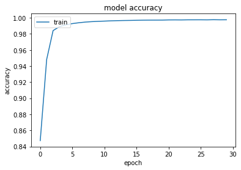
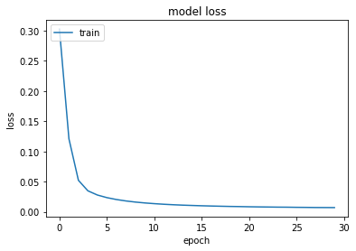
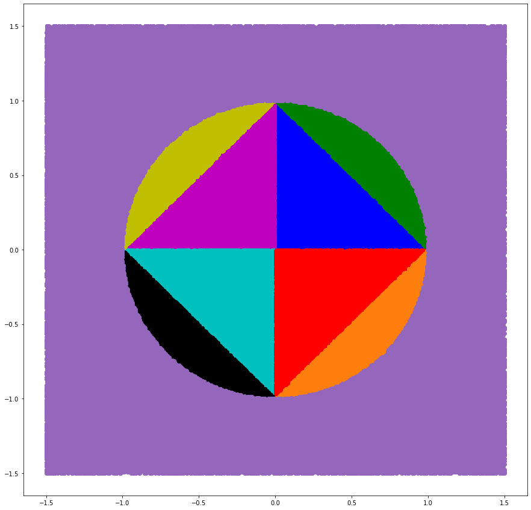
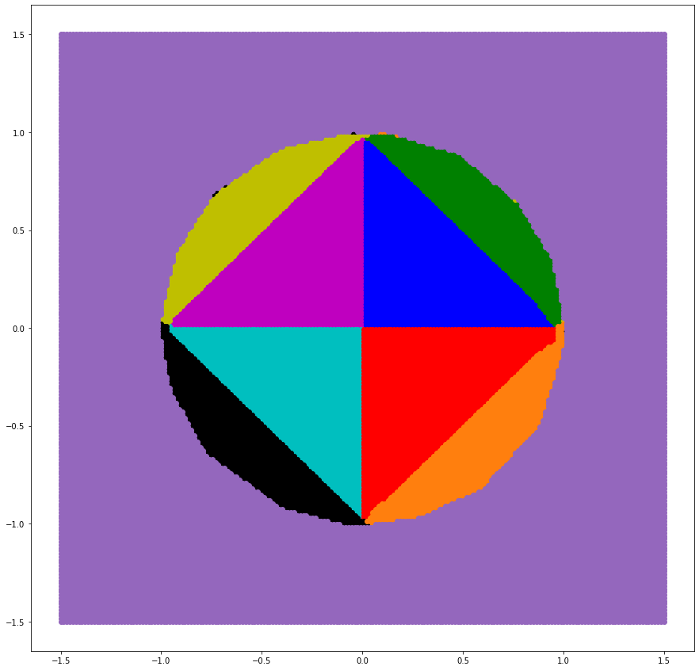

```python
import matplotlib.pyplot as plt
import math
import numpy as np
from sklearn.preprocessing import MinMaxScaler
import tensorflow
from tensorflow.keras.models import Sequential
from tensorflow.keras.layers import Dense
from tensorflow.keras.utils import to_categorical
```


```python
with open('data.npy', 'rb') as f:
    data = np.load(f)
    dataLabels = np.load(f)
testData = data[math.floor(len(data)*0.8):]
data = data[:math.floor(len(data)*0.8)]
testDataLabels = dataLabels[math.floor(len(dataLabels)*0.8):]
dataLabels = dataLabels[:math.floor(len(dataLabels)*0.8)]
dataset = tensorflow.data.Dataset.from_tensor_slices((data, dataLabels))
data
```


    array([[-1.20541082,  1.13927856],
           [ 0.61022044, -0.5260521 ],
           [-1.15130261, -1.07915832],
           ...,
           [ 0.42985972, -0.33967936],
           [ 0.70641283,  0.5741483 ],
           [ 0.64028056,  1.03106212]])


```python
model = Sequential()
model.add(Dense(12, input_shape=(2,), kernel_initializer='normal', activation='relu'))
model.add(Dense(16, activation='sigmoid', kernel_initializer='normal'))
model.add(Dense(4, activation='sigmoid', kernel_initializer='normal'))
model.summary()
```

    Model: "sequential"
    _________________________________________________________________
     Layer (type)                Output Shape              Param #   
    =================================================================
     dense (Dense)               (None, 12)                36        
                                                                     
     dense_1 (Dense)             (None, 16)                208       
                                                                     
     dense_2 (Dense)             (None, 4)                 68        
                                                                     
    =================================================================
    Total params: 312
    Trainable params: 312
    Non-trainable params: 0
    _________________________________________________________________
    


```python
model.compile(loss='binary_crossentropy', optimizer='adam', metrics=['binary_accuracy']) 
history = model.fit(data, dataLabels, epochs=30, batch_size=50, verbose=1)
```

    Epoch 1/30
    4000/4000 [==============================] - 4s 856us/step - loss: 0.3026 - binary_accuracy: 0.8474
    Epoch 2/30
    4000/4000 [==============================] - 4s 969us/step - loss: 0.1209 - binary_accuracy: 0.9482
    Epoch 3/30
    4000/4000 [==============================] - 4s 901us/step - loss: 0.0522 - binary_accuracy: 0.9840
    Epoch 4/30
    4000/4000 [==============================] - 4s 974us/step - loss: 0.0348 - binary_accuracy: 0.9890
    Epoch 5/30
    4000/4000 [==============================] - 3s 847us/step - loss: 0.0279 - binary_accuracy: 0.9912
    Epoch 6/30
    4000/4000 [==============================] - 4s 911us/step - loss: 0.0235 - binary_accuracy: 0.9927
    Epoch 7/30
    4000/4000 [==============================] - 3s 855us/step - loss: 0.0204 - binary_accuracy: 0.9938
    Epoch 8/30
    4000/4000 [==============================] - 4s 984us/step - loss: 0.0180 - binary_accuracy: 0.9946
    Epoch 9/30
    4000/4000 [==============================] - 4s 950us/step - loss: 0.0162 - binary_accuracy: 0.9951
    Epoch 10/30
    4000/4000 [==============================] - 4s 884us/step - loss: 0.0147 - binary_accuracy: 0.9955
    Epoch 11/30
    4000/4000 [==============================] - 4s 890us/step - loss: 0.0136 - binary_accuracy: 0.9958
    Epoch 12/30
    4000/4000 [==============================] - 4s 898us/step - loss: 0.0126 - binary_accuracy: 0.9962
    Epoch 13/30
    4000/4000 [==============================] - 4s 935us/step - loss: 0.0118 - binary_accuracy: 0.9964
    Epoch 14/30
    4000/4000 [==============================] - 3s 871us/step - loss: 0.0111 - binary_accuracy: 0.9965
    Epoch 15/30
    4000/4000 [==============================] - 4s 912us/step - loss: 0.0105 - binary_accuracy: 0.9967
    Epoch 16/30
    4000/4000 [==============================] - 3s 872us/step - loss: 0.0100 - binary_accuracy: 0.9968
    Epoch 17/30
    4000/4000 [==============================] - 4s 891us/step - loss: 0.0096 - binary_accuracy: 0.9970
    Epoch 18/30
    4000/4000 [==============================] - 3s 854us/step - loss: 0.0093 - binary_accuracy: 0.9970
    Epoch 19/30
    4000/4000 [==============================] - 4s 917us/step - loss: 0.0089 - binary_accuracy: 0.9971
    Epoch 20/30
    4000/4000 [==============================] - 4s 984us/step - loss: 0.0087 - binary_accuracy: 0.9971
    Epoch 21/30
    4000/4000 [==============================] - 4s 888us/step - loss: 0.0084 - binary_accuracy: 0.9973
    Epoch 22/30
    4000/4000 [==============================] - 3s 875us/step - loss: 0.0082 - binary_accuracy: 0.9973
    Epoch 23/30
    4000/4000 [==============================] - 3s 847us/step - loss: 0.0080 - binary_accuracy: 0.9973
    Epoch 24/30
    4000/4000 [==============================] - 3s 843us/step - loss: 0.0078 - binary_accuracy: 0.9974
    Epoch 25/30
    4000/4000 [==============================] - 3s 834us/step - loss: 0.0077 - binary_accuracy: 0.9974
    Epoch 26/30
    4000/4000 [==============================] - 3s 872us/step - loss: 0.0075 - binary_accuracy: 0.9974
    Epoch 27/30
    4000/4000 [==============================] - 3s 858us/step - loss: 0.0073 - binary_accuracy: 0.9974
    Epoch 28/30
    4000/4000 [==============================] - 4s 890us/step - loss: 0.0072 - binary_accuracy: 0.9975
    Epoch 29/30
    4000/4000 [==============================] - 3s 850us/step - loss: 0.0071 - binary_accuracy: 0.9974
    Epoch 30/30
    4000/4000 [==============================] - 3s 863us/step - loss: 0.0070 - binary_accuracy: 0.9975
    


```python
plt.plot(history.history['binary_accuracy'])
plt.title('model accuracy')
plt.ylabel('accuracy')
plt.xlabel('epoch')
plt.legend(['train', 'test'], loc='upper left')
plt.show()
```


    

    


```python
# summarize history for loss
plt.plot(history.history['loss'])
plt.title('model loss')
plt.ylabel('loss')
plt.xlabel('epoch')
plt.legend(['train', 'test'], loc='upper left')
plt.show()
```


    

    


```python
test_results = model.evaluate(testData, testDataLabels, verbose=1)
print(f'Test results - Loss: {test_results[0]} - Accuracy: {test_results[1]}%')
```

    1563/1563 [==============================] - 1s 816us/step - loss: 0.0070 - binary_accuracy: 0.9975
    Test results - Loss: 0.006966711021959782 - Accuracy: 0.9974750280380249%
    

### Test results - Loss: 0.006966711021959782 - Accuracy: 0.9974750280380249%


```python
groupsTestx = [[],[],[],[],[],[],[],[],[]]
groupsTesty = [[],[],[],[],[],[],[],[],[]]
testData = data
testDataLabels = dataLabels
for i in range(len(testData)):
    if(testDataLabels[i][3]>=0.5):
        groupsTestx[8].append(testData[i][0])
        groupsTesty[8].append(testData[i][1])
    elif(testDataLabels[i][0]>=0.5):
        if testDataLabels[i][1] >= 0.5:
            if testDataLabels[i][2]>=0.5:
                #111
                groupsTestx[6].append(testData[i][0])
                groupsTesty[6].append(testData[i][1])
            else:
                #110
                groupsTestx[7].append(testData[i][0])
                groupsTesty[7].append(testData[i][1])
        else:
            if testDataLabels[i][2]>=0.5:
                #101
                groupsTestx[5].append(testData[i][0])
                groupsTesty[5].append(testData[i][1])
            else:
                #100
                groupsTestx[4].append(testData[i][0])
                groupsTesty[4].append(testData[i][1])
    else:
        if testDataLabels[i][1] >= 0.5:
            if testDataLabels[i][2]>=0.5:
                #011
                groupsTestx[2].append(testData[i][0])
                groupsTesty[2].append(testData[i][1])
            else:
                #010
                groupsTestx[3].append(testData[i][0])
                groupsTesty[3].append(testData[i][1])
        else:
            if testDataLabels[i][2]>=0.5:
                #001
                groupsTestx[1].append(testData[i][0])
                groupsTesty[1].append(testData[i][1])
            else:
                #000
                groupsTestx[0].append(testData[i][0])
                groupsTesty[0].append(testData[i][1])
                
plt.rcParams['figure.figsize'] = [15, 15]
plt.scatter(groupsTestx[0],groupsTesty[0], c='b')
plt.scatter(groupsTestx[1],groupsTesty[1], c='m')
plt.scatter(groupsTestx[2],groupsTesty[2], c='c')
plt.scatter(groupsTestx[3],groupsTesty[3], c='r')
plt.scatter(groupsTestx[4],groupsTesty[4], c='g')
plt.scatter(groupsTestx[5],groupsTesty[5], c='y')
plt.scatter(groupsTestx[6],groupsTesty[6], c='k')
plt.scatter(groupsTestx[7],groupsTesty[7], c='tab:orange')
plt.scatter(groupsTestx[8],groupsTesty[8], c='tab:purple')
plt.show()
```


    

    


```python
testx = np.linspace(-1.5,1.5,200)
testy = np.linspace(-1.5,1.5,200)
dataTest=[]
for i in range(200):
  for j in range(200):
      dataTest.append([testx[i], testy[j]])  
prediction = []

prediction=(model.predict(np.array(dataTest)))
groupsTestx = [[],[],[],[],[],[],[],[],[]]
groupsTesty = [[],[],[],[],[],[],[],[], []]
for i in range(len(dataTest)):
    if(prediction[i][3]>=0.5):
        groupsTestx[8].append(dataTest[i][0])
        groupsTesty[8].append(dataTest[i][1])
    elif(prediction[i][0]>=0.5):
        if prediction[i][1] >= 0.5:
            if prediction[i][2]>=0.5:
                #111
                groupsTestx[6].append(dataTest[i][0])
                groupsTesty[6].append(dataTest[i][1])
            else:
                #110
                groupsTestx[7].append(dataTest[i][0])
                groupsTesty[7].append(dataTest[i][1])
        else:
            if prediction[i][2]>=0.5:
                #101
                groupsTestx[5].append(dataTest[i][0])
                groupsTesty[5].append(dataTest[i][1])
            else:
                #100
                groupsTestx[4].append(dataTest[i][0])
                groupsTesty[4].append(dataTest[i][1])
    else:
        if prediction[i][1] >= 0.5:
            if prediction[i][2]>=0.5:
                #011
                groupsTestx[2].append(dataTest[i][0])
                groupsTesty[2].append(dataTest[i][1])
            else:
                #010
                groupsTestx[3].append(dataTest[i][0])
                groupsTesty[3].append(dataTest[i][1])
        else:
            if prediction[i][2]>=0.5:
                #001
                groupsTestx[1].append(dataTest[i][0])
                groupsTesty[1].append(dataTest[i][1])
            else:
                #000
                groupsTestx[0].append(dataTest[i][0])
                groupsTesty[0].append(dataTest[i][1])
                
plt.rcParams['figure.figsize'] = [15, 15]
plt.scatter(groupsTestx[0],groupsTesty[0], c='b')
plt.scatter(groupsTestx[1],groupsTesty[1], c='m')
plt.scatter(groupsTestx[2],groupsTesty[2], c='c')
plt.scatter(groupsTestx[3],groupsTesty[3], c='r')
plt.scatter(groupsTestx[4],groupsTesty[4], c='g')
plt.scatter(groupsTestx[5],groupsTesty[5], c='y')
plt.scatter(groupsTestx[6],groupsTesty[6], c='k')
plt.scatter(groupsTestx[7],groupsTesty[7], c='tab:orange')
plt.scatter(groupsTestx[8],groupsTesty[8], c='tab:purple')
plt.show()
```


    

    


```python

```
