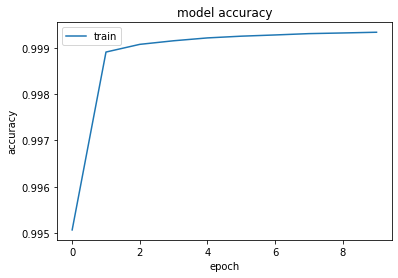
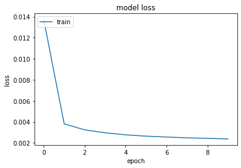
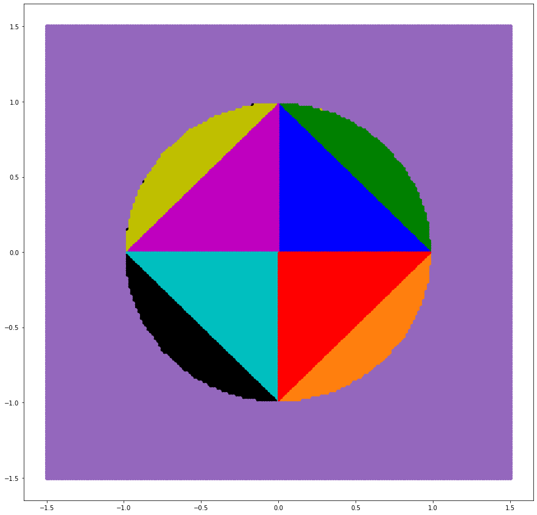

```python
import matplotlib.pyplot as plt
import math
import numpy as np
from sklearn.preprocessing import MinMaxScaler
import tensorflow
from tensorflow.keras.datasets import mnist
from tensorflow.keras.models import Sequential
from tensorflow.keras.layers import Dense
from tensorflow.keras.utils import to_categorical
```


```python
with open('dataLarge.npy', 'rb') as f:
    data = np.load(f)
    dataLabels = np.load(f)
testData = data[math.floor(len(data)*0.8):]
data = data[:math.floor(len(data)*0.8)]
testDataLabels = dataLabels[math.floor(len(dataLabels)*0.8):]
dataLabels = dataLabels[:math.floor(len(dataLabels)*0.8)]
dataset = tensorflow.data.Dataset.from_tensor_slices((data, dataLabels))
len(data)
```


    20000000


```python
model = Sequential()
model.add(Dense(12, input_shape=(2,), kernel_initializer='normal', activation='relu'))
model.add(Dense(16, activation='sigmoid', kernel_initializer='normal'))
model.add(Dense(4, activation='sigmoid', kernel_initializer='normal'))
model.summary()
```

    Model: "sequential"
    _________________________________________________________________
     Layer (type)                Output Shape              Param #   
    =================================================================
     dense (Dense)               (None, 16)                48        
                                                                     
     dense_1 (Dense)             (None, 16)                272       
                                                                     
     dense_2 (Dense)             (None, 4)                 68        
                                                                     
    =================================================================
    Total params: 388
    Trainable params: 388
    Non-trainable params: 0
    _________________________________________________________________
    


```python
optimizer=tensorflow.keras.optimizers.RMSprop() 
model.compile(loss='binary_crossentropy', optimizer='adam', metrics=['binary_accuracy']) 
history = model.fit(data, dataLabels, epochs=10, batch_size=100, verbose=1)
```

    Epoch 1/10
    200000/200000 [==============================] - 173s 856us/step - loss: 0.0137 - binary_accuracy: 0.9951
    Epoch 2/10
    200000/200000 [==============================] - 182s 908us/step - loss: 0.0038 - binary_accuracy: 0.9989
    Epoch 3/10
    200000/200000 [==============================] - 234s 1ms/step - loss: 0.0032 - binary_accuracy: 0.9991
    Epoch 4/10
    200000/200000 [==============================] - 264s 1ms/step - loss: 0.0030 - binary_accuracy: 0.9991
    Epoch 5/10
    200000/200000 [==============================] - 240s 1ms/step - loss: 0.0028 - binary_accuracy: 0.9992
    Epoch 6/10
    200000/200000 [==============================] - 209s 1ms/step - loss: 0.0026 - binary_accuracy: 0.9992
    Epoch 7/10
    200000/200000 [==============================] - 203s 1ms/step - loss: 0.0026 - binary_accuracy: 0.9993
    Epoch 8/10
    200000/200000 [==============================] - 198s 988us/step - loss: 0.0025 - binary_accuracy: 0.9993
    Epoch 9/10
    200000/200000 [==============================] - 204s 1ms/step - loss: 0.0024 - binary_accuracy: 0.9993
    Epoch 10/10
    200000/200000 [==============================] - 199s 997us/step - loss: 0.0024 - binary_accuracy: 0.9993
    


```python
plt.plot(history.history['binary_accuracy'])
plt.title('model accuracy')
plt.ylabel('accuracy')
plt.xlabel('epoch')
plt.legend(['train', 'test'], loc='upper left')
plt.show()
```


    

    


```python
# summarize history for loss
plt.plot(history.history['loss'])
plt.title('model loss')
plt.ylabel('loss')
plt.xlabel('epoch')
plt.legend(['train', 'test'], loc='upper left')
plt.show()
```


    

    


```python
test_results = model.evaluate(testData, testDataLabels, verbose=1)
print(f'Test results - Loss: {test_results[0]} - Accuracy: {test_results[1]}%')
```

    156250/156250 [==============================] - 127s 813us/step - loss: 0.0031 - binary_accuracy: 0.9987
    Test results - Loss: 0.003118484979495406 - Accuracy: 0.998660683631897%
    


```python
testx = np.linspace(-1.5,1.5,200)
testy = np.linspace(-1.5,1.5,200)
dataTest = []
for i in range(200):
  for j in range(200):
      dataTest.append([testx[i], testy[j]])  
prediction = []

prediction=(model.predict(np.array(dataTest)))
groupsTestx = [[],[],[],[],[],[],[],[],[]]
groupsTesty = [[],[],[],[],[],[],[],[], []]
for i in range(len(dataTest)):
    if(prediction[i][3]>=0.5):
        groupsTestx[8].append(dataTest[i][0])
        groupsTesty[8].append(dataTest[i][1])
    elif(prediction[i][0]>=0.5):
        if prediction[i][1] >= 0.5:
            if prediction[i][2]>=0.5:
                #111
                groupsTestx[6].append(dataTest[i][0])
                groupsTesty[6].append(dataTest[i][1])
            else:
                #110
                groupsTestx[7].append(dataTest[i][0])
                groupsTesty[7].append(dataTest[i][1])
        else:
            if prediction[i][2]>=0.5:
                #101
                groupsTestx[5].append(dataTest[i][0])
                groupsTesty[5].append(dataTest[i][1])
            else:
                #100
                groupsTestx[4].append(dataTest[i][0])
                groupsTesty[4].append(dataTest[i][1])
    else:
        if prediction[i][1] >= 0.5:
            if prediction[i][2]>=0.5:
                #011
                groupsTestx[2].append(dataTest[i][0])
                groupsTesty[2].append(dataTest[i][1])
            else:
                #010
                groupsTestx[3].append(dataTest[i][0])
                groupsTesty[3].append(dataTest[i][1])
        else:
            if prediction[i][2]>=0.5:
                #001
                groupsTestx[1].append(dataTest[i][0])
                groupsTesty[1].append(dataTest[i][1])
            else:
                #000
                groupsTestx[0].append(dataTest[i][0])
                groupsTesty[0].append(dataTest[i][1])
                
plt.rcParams['figure.figsize'] = [15, 15]
plt.scatter(groupsTestx[0],groupsTesty[0], c='b')
plt.scatter(groupsTestx[1],groupsTesty[1], c='m')
plt.scatter(groupsTestx[2],groupsTesty[2], c='c')
plt.scatter(groupsTestx[3],groupsTesty[3], c='r')
plt.scatter(groupsTestx[4],groupsTesty[4], c='g')
plt.scatter(groupsTestx[5],groupsTesty[5], c='y')
plt.scatter(groupsTestx[6],groupsTesty[6], c='k')
plt.scatter(groupsTestx[7],groupsTesty[7], c='tab:orange')
plt.scatter(groupsTestx[8],groupsTesty[8], c='tab:purple')
plt.show()
```


    

    


```python

```
