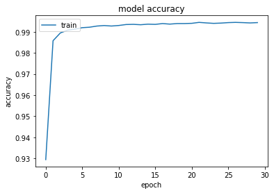
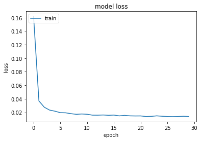
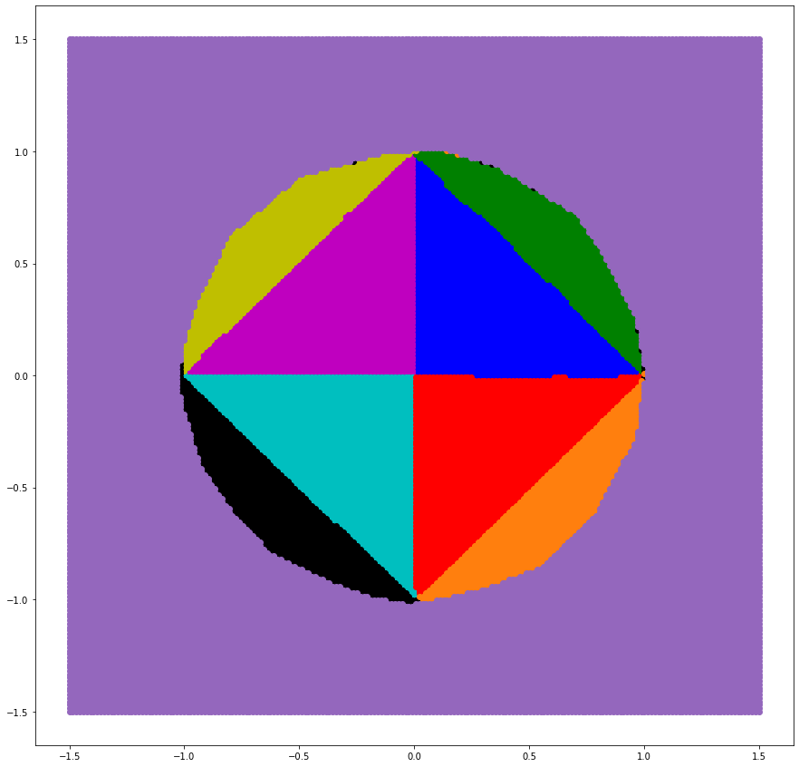

```python
import matplotlib.pyplot as plt
import math
import numpy as np
from sklearn.preprocessing import MinMaxScaler
import tensorflow
from tensorflow.keras.models import Sequential
from tensorflow.keras.optimizers import SGD
from tensorflow.keras.layers import Dense
from tensorflow.keras.utils import to_categorical
```


```python
with open('data.npy', 'rb') as f:
    data = np.load(f)
    dataLabels = np.load(f)
testData = data[math.floor(len(data)*0.8):]
data = data[:math.floor(len(data)*0.8)]
testDataLabels = dataLabels[math.floor(len(dataLabels)*0.8):]
dataLabels = dataLabels[:math.floor(len(dataLabels)*0.8)]
dataset = tensorflow.data.Dataset.from_tensor_slices((data, dataLabels))
len(data)
```


    200000


```python
model = Sequential()
model.add(Dense(12, input_shape=(2,), kernel_initializer='normal', activation='relu'))
model.add(Dense(16, activation='sigmoid', kernel_initializer='normal'))
model.add(Dense(4, activation='sigmoid', kernel_initializer='normal'))
model.summary()
```

    Model: "sequential"
    _________________________________________________________________
     Layer (type)                Output Shape              Param #   
    =================================================================
     dense (Dense)               (None, 12)                36        
                                                                     
     dense_1 (Dense)             (None, 16)                208       
                                                                     
     dense_2 (Dense)             (None, 4)                 68        
                                                                     
    =================================================================
    Total params: 312
    Trainable params: 312
    Non-trainable params: 0
    _________________________________________________________________
    


```python
optimizer = SGD(learning_rate=0.1, momentum=0.9)
model.compile(loss='binary_crossentropy', optimizer=optimizer, metrics=['binary_accuracy']) 
history = model.fit(data, dataLabels, epochs=30, batch_size=50, verbose=1)
```

    Epoch 1/30
    4000/4000 [==============================] - 3s 668us/step - loss: 0.1619 - binary_accuracy: 0.9295
    Epoch 2/30
    4000/4000 [==============================] - 3s 684us/step - loss: 0.0368 - binary_accuracy: 0.9858
    Epoch 3/30
    4000/4000 [==============================] - 3s 693us/step - loss: 0.0276 - binary_accuracy: 0.9894
    Epoch 4/30
    4000/4000 [==============================] - 3s 726us/step - loss: 0.0233 - binary_accuracy: 0.9908
    Epoch 5/30
    4000/4000 [==============================] - 3s 732us/step - loss: 0.0217 - binary_accuracy: 0.9913
    Epoch 6/30
    4000/4000 [==============================] - 3s 746us/step - loss: 0.0195 - binary_accuracy: 0.9919
    Epoch 7/30
    4000/4000 [==============================] - 3s 758us/step - loss: 0.0193 - binary_accuracy: 0.9922
    Epoch 8/30
    4000/4000 [==============================] - 3s 688us/step - loss: 0.0180 - binary_accuracy: 0.9927
    Epoch 9/30
    4000/4000 [==============================] - 3s 687us/step - loss: 0.0171 - binary_accuracy: 0.9929
    Epoch 10/30
    4000/4000 [==============================] - 3s 729us/step - loss: 0.0176 - binary_accuracy: 0.9927
    Epoch 11/30
    4000/4000 [==============================] - 3s 796us/step - loss: 0.0172 - binary_accuracy: 0.9930
    Epoch 12/30
    4000/4000 [==============================] - 3s 799us/step - loss: 0.0159 - binary_accuracy: 0.9934
    Epoch 13/30
    4000/4000 [==============================] - 3s 841us/step - loss: 0.0158 - binary_accuracy: 0.9935
    Epoch 14/30
    4000/4000 [==============================] - 3s 814us/step - loss: 0.0161 - binary_accuracy: 0.9933
    Epoch 15/30
    4000/4000 [==============================] - 3s 853us/step - loss: 0.0156 - binary_accuracy: 0.9936
    Epoch 16/30
    4000/4000 [==============================] - 3s 804us/step - loss: 0.0160 - binary_accuracy: 0.9935
    Epoch 17/30
    4000/4000 [==============================] - 3s 803us/step - loss: 0.0148 - binary_accuracy: 0.9939
    Epoch 18/30
    4000/4000 [==============================] - 3s 786us/step - loss: 0.0155 - binary_accuracy: 0.9936
    Epoch 19/30
    4000/4000 [==============================] - 3s 760us/step - loss: 0.0148 - binary_accuracy: 0.9939
    Epoch 20/30
    4000/4000 [==============================] - 3s 755us/step - loss: 0.0147 - binary_accuracy: 0.9939
    Epoch 21/30
    4000/4000 [==============================] - 3s 771us/step - loss: 0.0147 - binary_accuracy: 0.9940
    Epoch 22/30
    4000/4000 [==============================] - 3s 745us/step - loss: 0.0138 - binary_accuracy: 0.9944
    Epoch 23/30
    4000/4000 [==============================] - 3s 782us/step - loss: 0.0141 - binary_accuracy: 0.9942
    Epoch 24/30
    4000/4000 [==============================] - 3s 743us/step - loss: 0.0149 - binary_accuracy: 0.9940
    Epoch 25/30
    4000/4000 [==============================] - 3s 837us/step - loss: 0.0142 - binary_accuracy: 0.9941
    Epoch 26/30
    4000/4000 [==============================] - 3s 827us/step - loss: 0.0138 - binary_accuracy: 0.9943
    Epoch 27/30
    4000/4000 [==============================] - 3s 809us/step - loss: 0.0137 - binary_accuracy: 0.9944
    Epoch 28/30
    4000/4000 [==============================] - 3s 765us/step - loss: 0.0138 - binary_accuracy: 0.9943
    Epoch 29/30
    4000/4000 [==============================] - 3s 759us/step - loss: 0.0142 - binary_accuracy: 0.9942
    Epoch 30/30
    4000/4000 [==============================] - 3s 808us/step - loss: 0.0138 - binary_accuracy: 0.9943
    


```python
plt.plot(history.history['binary_accuracy'])
plt.title('model accuracy')
plt.ylabel('accuracy')
plt.xlabel('epoch')
plt.legend(['train', 'test'], loc='upper left')
plt.show()
```


    

    


```python
# summarize history for loss
plt.plot(history.history['loss'])
plt.title('model loss')
plt.ylabel('loss')
plt.xlabel('epoch')
plt.legend(['train', 'test'], loc='upper left')
plt.show()
```


    

    


```python
test_results = model.evaluate(testData, testDataLabels, verbose=1)
print(f'Test results - Loss: {test_results[0]} - Accuracy: {test_results[1]}%')
```

    1563/1563 [==============================] - 1s 668us/step - loss: 0.0120 - binary_accuracy: 0.9953
    Test results - Loss: 0.012023674324154854 - Accuracy: 0.9953299760818481%
    

### Test results - Loss: 0.006966711021959782 - Accuracy: 0.9974750280380249%


```python
groupsTestx = [[],[],[],[],[],[],[],[],[]]
groupsTesty = [[],[],[],[],[],[],[],[],[]]
testData = data
testDataLabels = dataLabels
for i in range(len(testData)):
    if(testDataLabels[i][3]>=0.5):
        groupsTestx[8].append(testData[i][0])
        groupsTesty[8].append(testData[i][1])
    elif(testDataLabels[i][0]>=0.5):
        if testDataLabels[i][1] >= 0.5:
            if testDataLabels[i][2]>=0.5:
                #111
                groupsTestx[6].append(testData[i][0])
                groupsTesty[6].append(testData[i][1])
            else:
                #110
                groupsTestx[7].append(testData[i][0])
                groupsTesty[7].append(testData[i][1])
        else:
            if testDataLabels[i][2]>=0.5:
                #101
                groupsTestx[5].append(testData[i][0])
                groupsTesty[5].append(testData[i][1])
            else:
                #100
                groupsTestx[4].append(testData[i][0])
                groupsTesty[4].append(testData[i][1])
    else:
        if testDataLabels[i][1] >= 0.5:
            if testDataLabels[i][2]>=0.5:
                #011
                groupsTestx[2].append(testData[i][0])
                groupsTesty[2].append(testData[i][1])
            else:
                #010
                groupsTestx[3].append(testData[i][0])
                groupsTesty[3].append(testData[i][1])
        else:
            if testDataLabels[i][2]>=0.5:
                #001
                groupsTestx[1].append(testData[i][0])
                groupsTesty[1].append(testData[i][1])
            else:
                #000
                groupsTestx[0].append(testData[i][0])
                groupsTesty[0].append(testData[i][1])
                
plt.rcParams['figure.figsize'] = [15, 15]
plt.scatter(groupsTestx[0],groupsTesty[0], c='b')
plt.scatter(groupsTestx[1],groupsTesty[1], c='m')
plt.scatter(groupsTestx[2],groupsTesty[2], c='c')
plt.scatter(groupsTestx[3],groupsTesty[3], c='r')
plt.scatter(groupsTestx[4],groupsTesty[4], c='g')
plt.scatter(groupsTestx[5],groupsTesty[5], c='y')
plt.scatter(groupsTestx[6],groupsTesty[6], c='k')
plt.scatter(groupsTestx[7],groupsTesty[7], c='tab:orange')
plt.scatter(groupsTestx[8],groupsTesty[8], c='tab:purple')
plt.show()
```


    

    


```python
testx = np.linspace(-1.5,1.5,200)
testy = np.linspace(-1.5,1.5,200)
dataTest=[]
for i in range(200):
  for j in range(200):
      dataTest.append([testx[i], testy[j]])  
prediction = []

prediction=(model.predict(np.array(dataTest)))
groupsTestx = [[],[],[],[],[],[],[],[],[]]
groupsTesty = [[],[],[],[],[],[],[],[], []]
for i in range(len(dataTest)):
    if(prediction[i][3]>=0.5):
        groupsTestx[8].append(dataTest[i][0])
        groupsTesty[8].append(dataTest[i][1])
    elif(prediction[i][0]>=0.5):
        if prediction[i][1] >= 0.5:
            if prediction[i][2]>=0.5:
                #111
                groupsTestx[6].append(dataTest[i][0])
                groupsTesty[6].append(dataTest[i][1])
            else:
                #110
                groupsTestx[7].append(dataTest[i][0])
                groupsTesty[7].append(dataTest[i][1])
        else:
            if prediction[i][2]>=0.5:
                #101
                groupsTestx[5].append(dataTest[i][0])
                groupsTesty[5].append(dataTest[i][1])
            else:
                #100
                groupsTestx[4].append(dataTest[i][0])
                groupsTesty[4].append(dataTest[i][1])
    else:
        if prediction[i][1] >= 0.5:
            if prediction[i][2]>=0.5:
                #011
                groupsTestx[2].append(dataTest[i][0])
                groupsTesty[2].append(dataTest[i][1])
            else:
                #010
                groupsTestx[3].append(dataTest[i][0])
                groupsTesty[3].append(dataTest[i][1])
        else:
            if prediction[i][2]>=0.5:
                #001
                groupsTestx[1].append(dataTest[i][0])
                groupsTesty[1].append(dataTest[i][1])
            else:
                #000
                groupsTestx[0].append(dataTest[i][0])
                groupsTesty[0].append(dataTest[i][1])
                
plt.rcParams['figure.figsize'] = [15, 15]
plt.scatter(groupsTestx[0],groupsTesty[0], c='b')
plt.scatter(groupsTestx[1],groupsTesty[1], c='m')
plt.scatter(groupsTestx[2],groupsTesty[2], c='c')
plt.scatter(groupsTestx[3],groupsTesty[3], c='r')
plt.scatter(groupsTestx[4],groupsTesty[4], c='g')
plt.scatter(groupsTestx[5],groupsTesty[5], c='y')
plt.scatter(groupsTestx[6],groupsTesty[6], c='k')
plt.scatter(groupsTestx[7],groupsTesty[7], c='tab:orange')
plt.scatter(groupsTestx[8],groupsTesty[8], c='tab:purple')
plt.show()
```


    

    


```python

```
